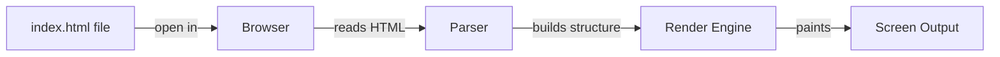

# T04: Hello World

Toda jornada começa com um único passo. Em desenvolvimento web, esse passo é criar seu primeiro arquivo HTML e vê-lo ganhar vida no navegador. Pense nisso como escrever uma carta - você escreve, entrega para alguém que lê em voz alta.
{: .lesson-intro }

## Sua Primeira Página Web

Crie um arquivo chamado `index.html`. Esse é o nome convencional da página principal de qualquer site. O navegador lê esse arquivo e o renderiza visualmente para o usuário.

```
<!DOCTYPE html>
<html lang="en">
<head>
    <meta charset="UTF-8">
    <title>My First Page</title>
</head>
<body>
    <h1>Hello World</h1>
    <p>This is my first web page.</p>
</body>
</html>
```

## Como Funciona

Quando você dá dois cliques no arquivo ou o arrasta para o navegador, o navegador lê o texto bruto, interpreta as tags HTML e pinta o resultado na tela. Nenhum servidor é necessário nesta etapa.



## A Declaração DOCTYPE

A linha `<!DOCTYPE html>` diz ao navegador para usar os padrões modernos do HTML5. Sem ela, o navegador pode cair em modos de renderização antigos e esquisitos.

<div class="takeaways">
<h2>Pontos-chave</h2>
<ul>
<li>Um arquivo HTML é só um arquivo de texto com extensão .html</li>
<li>O navegador é seu intérprete - ele lê HTML e mostra o resultado</li>
<li>Sempre inclua as tags DOCTYPE, html, head e body</li>
<li>index.html é o nome de arquivo padrão para a página principal de um site</li>
</ul>
</div>
