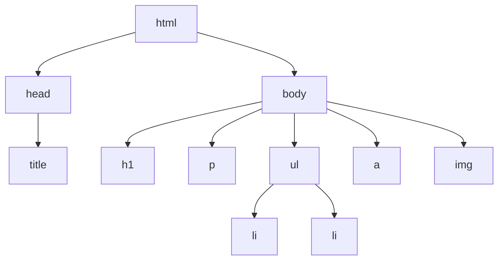

# T05: HTMLタグ - 基本要素

HTMLタグは箱に貼るラベルのようなものです。各タグがブラウザにコンテンツの種類を伝えます。見出しタグは「これはタイトル」、段落タグは「これはテキストブロック」と伝えます。ブラウザはこれらのラベルを使って適切に表示します。 {.lesson-intro}

## 見出しとテキスト

HTMLには`<h1>`(最重要)から`<h6>`(最小)まで6段階の見出しがあります。段落には`<p>`タグを使います。

```
<h1>Main Title</h1>
<h2>Section Title</h2>
<h3>Subsection</h3>
<p>A paragraph of text goes here.</p>
```

## リンクと画像

アンカータグ`<a>`はクリック可能なリンクを作成します。画像タグ``は写真を埋め込みます。imgは自己閉じタグです。

```
<a href="https://example.com">Visit Example</a>

```

## リスト

順序なしリストは`<ul>`と`<li>`を使います(箇条書き)。順序付きリストは`<ol>`を使います(番号付き)。

```
<ul>
    <li>First item</li>
    <li>Second item</li>
</ul>
```



<div class="takeaways">
<h2>まとめ</h2>
<ul>
<li>見出しh1-h6はコンテンツの階層を作ります。順番に使いましょう</li>
<li>リンクはaタグとhref属性でリンク先URLを指定します</li>
<li>画像はimgタグとsrc属性、alt属性を使います</li>
<li>リストは2種類: ulは箇条書き、olは番号付き</li>
</ul>
</div>
