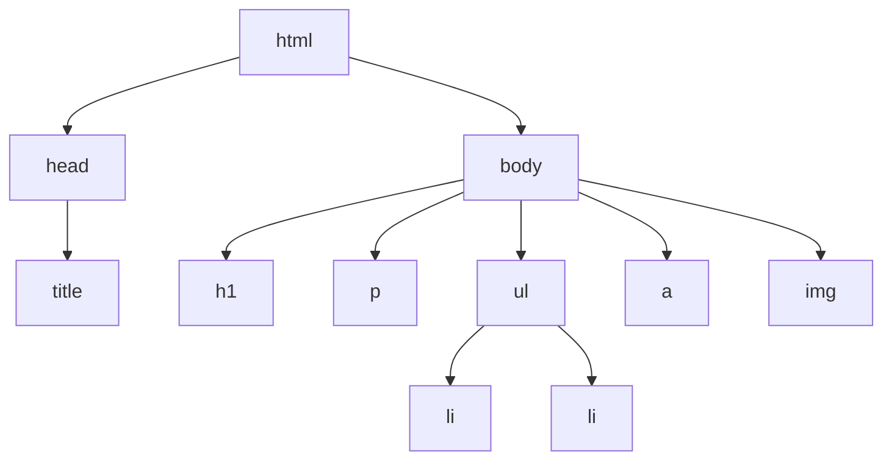

# T05: HTML Tags

HTML tags are like labels on boxes. Each tag tells the browser what kind of content is inside. A heading tag says "this is a title," a paragraph tag says "this is a block of text." The browser uses these labels to display content appropriately. {.lesson-intro}

## Headings and Text

HTML provides six levels of headings, from `<h1>` (most important) to `<h6>` (least). Paragraphs use the `<p>` tag.

```
<h1>Main Title</h1>
<h2>Section Title</h2>
<h3>Subsection</h3>
<p>A paragraph of text goes here.</p>
```

## Links and Images

The anchor tag `<a>` creates clickable links. The image tag `` embeds pictures. Note that img is a self-closing tag.

```
<a href="https://example.com">Visit Example</a>

```

## Lists

Unordered lists use `<ul>` with `<li>` items (bullet points). Ordered lists use `<ol>` (numbered items).

```
<ul>
    <li>First item</li>
    <li>Second item</li>
</ul>
```



<div class="takeaways">
<h2>Key Takeaways</h2>
<ul>
<li>Headings h1-h6 create a content hierarchy - use them in order</li>
<li>Links use the a tag with an href attribute for the destination URL</li>
<li>Images use the img tag with src and alt attributes</li>
<li>Lists come in two flavors: ul for bullets, ol for numbers</li>
</ul>
</div>
