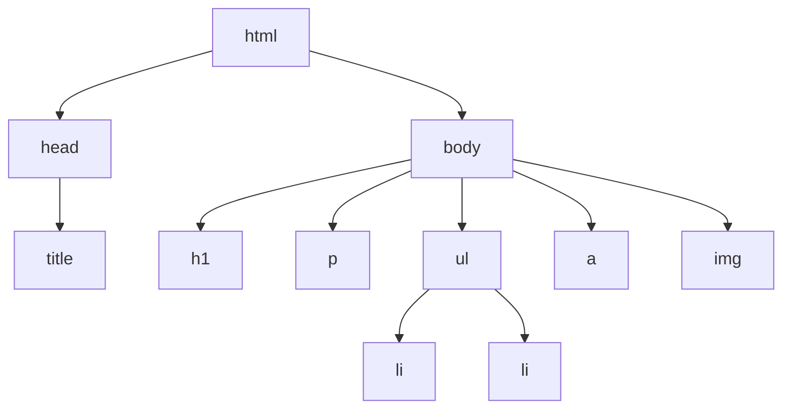

# T05: Tags HTML

Tags HTML são como etiquetas em caixas. Cada tag diz ao navegador que tipo de conteúdo está dentro. Uma tag de cabeçalho diz "isto é um título", uma tag de parágrafo diz "isto é um bloco de texto". O navegador usa essas etiquetas para exibir o conteúdo de forma apropriada.
{: .lesson-intro }

## Cabeçalhos e Texto

HTML oferece seis níveis de cabeçalho, de `<h1>` (mais importante) a `<h6>` (menos importante). Parágrafos usam a tag `<p>`.

```
<h1>Main Title</h1>
<h2>Section Title</h2>
<h3>Subsection</h3>
<p>A paragraph of text goes here.</p>
```

## Links e Imagens

A tag âncora `<a>` cria links clicáveis. A tag de imagem `` embute figuras. Note que img é uma tag auto-fechada.

```
<a href="https://example.com">Visit Example</a>

```

## Listas

Listas não ordenadas usam `<ul>` com itens `<li>` (marcadores). Listas ordenadas usam `<ol>` (itens numerados).

```
<ul>
    <li>First item</li>
    <li>Second item</li>
</ul>
```



<div class="takeaways">
<h2>Key Takeaways</h2>
<ul>
<li>Cabeçalhos h1-h6 criam uma hierarquia de conteúdo - use em ordem</li>
<li>Links usam a tag a com o atributo href para a URL de destino</li>
<li>Imagens usam a tag img com atributos src e alt</li>
<li>Listas vêm em dois sabores: ul para marcadores, ol para números</li>
</ul>
</div>
