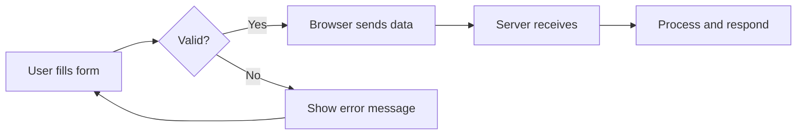

# T06: HTMLフォームとブロック要素

フォームはユーザーとアプリケーションの架け橋です。病院の問診票のように、HTMLフォームはユーザーから情報を収集し、処理のために送信します。details/summaryなどのブロック要素はJavaScriptなしでインタラクティブな開閉機能を追加します。 {.lesson-intro}

## フォーム要素

`<form>`タグは入力要素を囲みます。各入力にはtypeがあり動作を制御します。`required`属性は送信前にフィールドの入力を強制します。

```
<form action="/submit" method="POST">
    <label for="name">Name:</label>
    <input type="text" id="name" name="name" required>

    <label for="email">Email:</label>
    <input type="email" id="email" name="email" required>

    <label for="role">Role:</label>
    <select id="role" name="role">
        <option value="dev">Developer</option>
        <option value="design">Designer</option>
    </select>

    <textarea name="message" rows="4"></textarea>
    <button type="submit">Send</button>
</form>
```



## DetailsとSummary

`<details>`と`<summary>`要素はJavaScriptゼロで展開可能なセクションを作成します。

```
<details>
    <summary>Click to expand</summary>
    <p>Hidden content revealed on click.</p>
</details>
```

<div class="takeaways">
<h2>まとめ</h2>
<ul>
<li>フォームはaction属性とmethod属性でデータの送信先と方法を制御します</li>
<li>入力タイプにはtext、email、password、numberなどがあります</li>
<li>required属性はブラウザ組み込みのバリデーションを提供します</li>
<li>details/summaryはJavaScriptなしでインタラクティブな開閉を実現します</li>
</ul>
</div>
