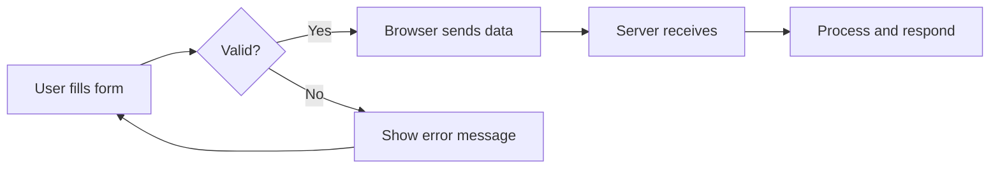

# T06: HTML Forms and Blocks

Forms are the bridge between users and your application. Like a paper form at a doctor's office, HTML forms collect information from users and send it somewhere for processing. Block elements like details/summary add interactive disclosure without JavaScript. {.lesson-intro}

## Form Elements

The `<form>` tag wraps input elements. Each input has a type that controls its behavior. The `required` attribute forces the user to fill in a field before submitting.

```
<form action="/submit" method="POST">
    <label for="name">Name:</label>
    <input type="text" id="name" name="name" required>

    <label for="email">Email:</label>
    <input type="email" id="email" name="email" required>

    <label for="role">Role:</label>
    <select id="role" name="role">
        <option value="dev">Developer</option>
        <option value="design">Designer</option>
    </select>

    <textarea name="message" rows="4"></textarea>
    <button type="submit">Send</button>
</form>
```



## Details and Summary

The `<details>` and `<summary>` elements create expandable sections with zero JavaScript.

```
<details>
    <summary>Click to expand</summary>
    <p>Hidden content revealed on click.</p>
</details>
```

<div class="takeaways">
<h2>Key Takeaways</h2>
<ul>
<li>Forms use action and method attributes to control where and how data is sent</li>
<li>Input types include text, email, password, number, and more</li>
<li>The required attribute provides built-in browser validation</li>
<li>Details/summary gives you interactive disclosure without JavaScript</li>
</ul>
</div>
