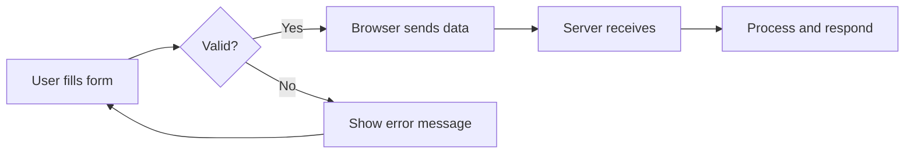

# T06: Formulários HTML e Blocos

Formulários são a ponte entre os usuários e sua aplicação. Como um formulário em papel no consultório médico, formulários HTML coletam informação dos usuários e a enviam para algum lugar para ser processada. Elementos de bloco como details/summary adicionam revelação interativa sem JavaScript.
{: .lesson-intro }

## Elementos de Formulário

A tag `<form>` envolve os elementos de entrada. Cada input tem um tipo que controla seu comportamento. O atributo `required` força o usuário a preencher o campo antes de enviar.

```
<form action="/submit" method="POST">
    <label for="name">Name:</label>
    <input type="text" id="name" name="name" required>

    <label for="email">Email:</label>
    <input type="email" id="email" name="email" required>

    <label for="role">Role:</label>
    <select id="role" name="role">
        <option value="dev">Developer</option>
        <option value="design">Designer</option>
    </select>

    <textarea name="message" rows="4"></textarea>
    <button type="submit">Send</button>
</form>
```



## Details e Summary

Os elementos `<details>` e `<summary>` criam seções expansíveis com zero JavaScript.

```
<details>
    <summary>Click to expand</summary>
    <p>Hidden content revealed on click.</p>
</details>
```

<div class="takeaways">
<h2>Key Takeaways</h2>
<ul>
<li>Formulários usam os atributos action e method para controlar para onde e como os dados são enviados</li>
<li>Tipos de input incluem text, email, password, number e outros</li>
<li>O atributo required oferece validação nativa do navegador</li>
<li>Details/summary dá revelação interativa sem JavaScript</li>
</ul>
</div>
