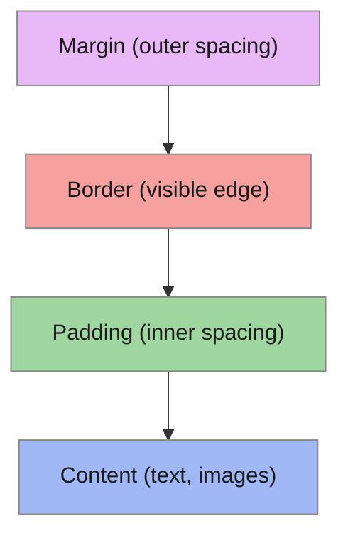

# T07: CSS基礎 - スタイルの世界

HTMLがWebページの骨格なら、CSSは肌、服、化粧です。CSS(カスケーディングスタイルシート)は要素の見た目を制御します。色、フォント、余白、サイズなど。「カスケーディング」とは、スタイルが予測可能な順序で上書きされることを意味します。
{: .lesson-intro }

## セレクタとプロパティ

CSSルールはセレクタ(どの要素をスタイルするか)と宣言(どうスタイルするか)で構成されます。セレクタはタグ、クラス、IDを対象にできます。

```
/* Tag selector */
h1 { color: navy; }

/* Class selector */
.highlight { background-color: yellow; }

/* ID selector */
#main-title { font-size: 2rem; }

/* Combined */
p.intro { font-style: italic; }
```

## 色とフォント

色は名前、16進コード、rgb値で指定できます。フォントプロパティは書体、サイズ、太さ、行の高さを制御します。

```
body {
    font-family: Arial, sans-serif;
    font-size: 16px;
    line-height: 1.5;
    color: #333333;
    background-color: rgb(245, 245, 245);
}
```

## ボックスモデル

全てのHTML要素は長方形のボックスです。内側から外側へ: content、padding、border、margin。このモデルの理解はレイアウト制御に不可欠です。



<div class="takeaways">
<h2>まとめ</h2>
<ul>
<li>CSSセレクタはタグ名、クラス(.name)、ID(#name)で要素を対象にします</li>
<li>ボックスモデルは4層構造: content、padding、border、margin</li>
<li>box-sizing: border-boxでwidthにpaddingとborderを含められます</li>
<li>詳細度(specificity)が複数のルールが競合した時にどちらが勝つかを決定します</li>
</ul>
</div>
