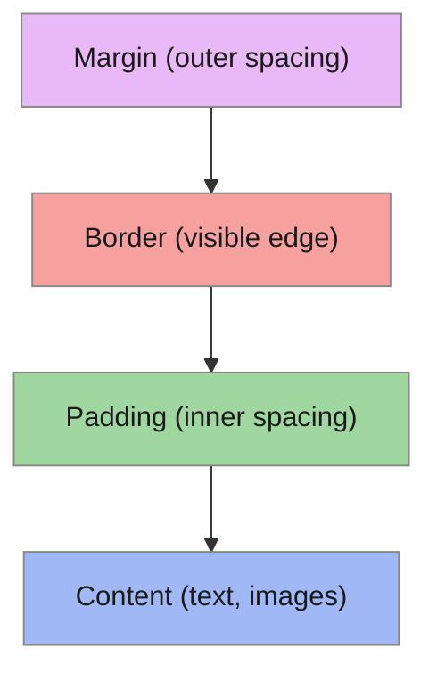

# T07: CSS Basics

If HTML is the skeleton of a web page, CSS is the skin, clothing, and makeup. CSS (Cascading Style Sheets) controls how elements look - their colors, fonts, spacing, and size. The "cascading" part means styles can override each other in a predictable order. {.lesson-intro}

## Selectors and Properties

CSS rules consist of a selector (which elements to style) and declarations (how to style them). Selectors can target tags, classes, or IDs.

```
/* Tag selector */
h1 { color: navy; }

/* Class selector */
.highlight { background-color: yellow; }

/* ID selector */
#main-title { font-size: 2rem; }

/* Combined */
p.intro { font-style: italic; }
```

## Colors and Fonts

Colors can be specified by name, hex code, or rgb values. Font properties control the typeface, size, weight, and line height.

```
body {
    font-family: Arial, sans-serif;
    font-size: 16px;
    line-height: 1.5;
    color: #333333;
    background-color: rgb(245, 245, 245);
}
```

## The Box Model

Every HTML element is a rectangular box. From inside out: content, padding, border, margin. Understanding this model is essential to controlling layout.



<div class="takeaways">
<h2>Key Takeaways</h2>
<ul>
<li>CSS selectors target elements by tag name, class (.name), or ID (#name)</li>
<li>The box model has four layers: content, padding, border, margin</li>
<li>Use box-sizing: border-box to make width include padding and border</li>
<li>Specificity determines which CSS rule wins when multiple rules conflict</li>
</ul>
</div>
