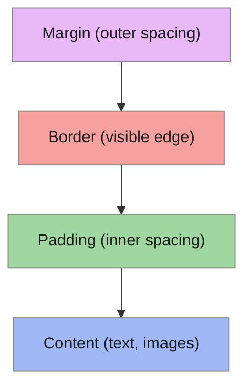

# T07: Fundamentos de CSS

Se HTML é o esqueleto de uma página web, CSS é a pele, a roupa e a maquiagem. CSS (Cascading Style Sheets) controla como os elementos parecem - suas cores, fontes, espaçamento e tamanho. O "cascading" significa que os estilos podem se sobrescrever numa ordem previsível.
{: .lesson-intro }

## Seletores e Propriedades

Regras CSS consistem de um seletor (quais elementos estilizar) e declarações (como estilizar). Seletores podem mirar em tags, classes ou IDs.

```
/* Tag selector */
h1 { color: navy; }

/* Class selector */
.highlight { background-color: yellow; }

/* ID selector */
#main-title { font-size: 2rem; }

/* Combined */
p.intro { font-style: italic; }
```

## Cores e Fontes

Cores podem ser especificadas por nome, código hex ou valores rgb. Propriedades de fonte controlam o tipo, tamanho, peso e altura de linha.

```
body {
    font-family: Arial, sans-serif;
    font-size: 16px;
    line-height: 1.5;
    color: #333333;
    background-color: rgb(245, 245, 245);
}
```

## O Box Model

Todo elemento HTML é uma caixa retangular. De dentro para fora: conteúdo, padding, borda, margem. Entender esse modelo é essencial para controlar o layout.



<div class="takeaways">
<h2>Pontos-chave</h2>
<ul>
<li>Seletores CSS miram em elementos por nome de tag, classe (.name) ou ID (#name)</li>
<li>O box model tem quatro camadas: conteúdo, padding, borda, margem</li>
<li>Use box-sizing: border-box para que width inclua padding e borda</li>
<li>Especificidade determina qual regra CSS ganha quando várias regras conflitam</li>
</ul>
</div>
