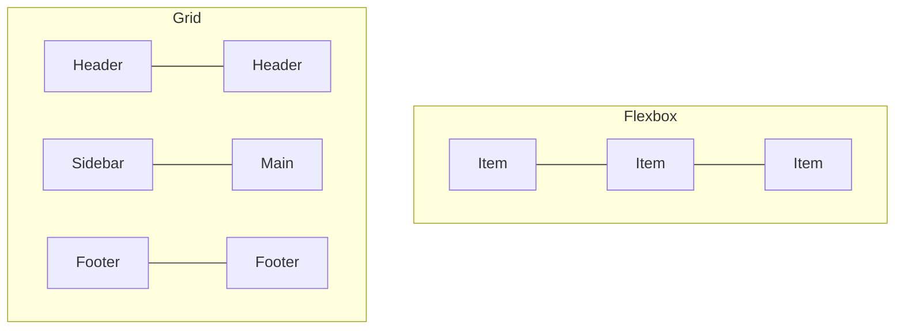

# T08: CSSレイアウト - 配置の技術

かつてページ上の要素配置は大変でした。FlexboxとGridが全てを変えました。Flexboxは一列に並べること(本棚の本のように)、Gridは行と列で整理すること(スプレッドシートのように)と考えてください。 {.lesson-intro}

## Flexbox

Flexboxは一度に一方向で動作します。コンテナに`display: flex`を設定し、子要素の配置と余白の配分を制御します。

```
.nav {
    display: flex;
    justify-content: space-between;
    align-items: center;
    gap: 1rem;
}

.nav-item {
    flex: 1;
}
```

## CSS Grid

Gridは二方向を同時に扱います。行と列を定義し、グリッドセルにアイテムを配置します。

```
.layout {
    display: grid;
    grid-template-columns: 250px 1fr;
    grid-template-rows: auto 1fr auto;
    gap: 1rem;
    min-height: 100vh;
}
```

## レスポンシブデザイン

メディアクエリで画面サイズに応じた異なるスタイルを適用できます。モバイルファーストとは小さい画面用の基本スタイルを書き、大きい画面用に複雑さを加えるアプローチです。

```
@media (min-width: 768px) {
    .layout { grid-template-columns: 250px 1fr; }
}
```



<div class="takeaways">
<h2>まとめ</h2>
<ul>
<li>Flexboxは一次元レイアウト向け(行または列)</li>
<li>Gridは二次元レイアウト向け(行と列を同時に)</li>
<li>メディアクエリで画面サイズに適応するレスポンシブデザインを実現</li>
<li>モバイルファースト: 小さく始めて、大きい画面向けに拡張する</li>
</ul>
</div>
