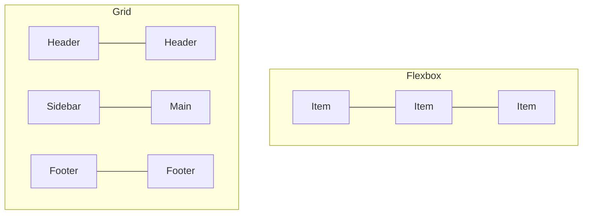

# T08: CSS Layout

Placing elements on a page used to be painful. Flexbox and Grid changed everything. Think of Flexbox as arranging items in a single line (like books on a shelf), and Grid as organizing items in rows and columns (like a spreadsheet).
{: .lesson-intro }

## Flexbox

Flexbox works in one dimension at a time. Set `display: flex` on a container, then control how children align and distribute space.

```
.nav {
    display: flex;
    justify-content: space-between;
    align-items: center;
    gap: 1rem;
}

.nav-item {
    flex: 1;
}
```

## CSS Grid

Grid works in two dimensions simultaneously. Define rows and columns, then place items into the grid cells.

```
.layout {
    display: grid;
    grid-template-columns: 250px 1fr;
    grid-template-rows: auto 1fr auto;
    gap: 1rem;
    min-height: 100vh;
}
```

## Responsive Design

Media queries let you apply different styles based on screen size. Mobile-first means writing base styles for small screens and adding complexity for larger ones.

```
@media (min-width: 768px) {
    .layout { grid-template-columns: 250px 1fr; }
}
```



<div class="takeaways">
<h2>Key Takeaways</h2>
<ul>
<li>Flexbox is for one-dimensional layouts (row or column)</li>
<li>Grid is for two-dimensional layouts (rows and columns together)</li>
<li>Use media queries for responsive design that adapts to screen size</li>
<li>Mobile-first approach: start small, add complexity for larger screens</li>
</ul>
</div>
