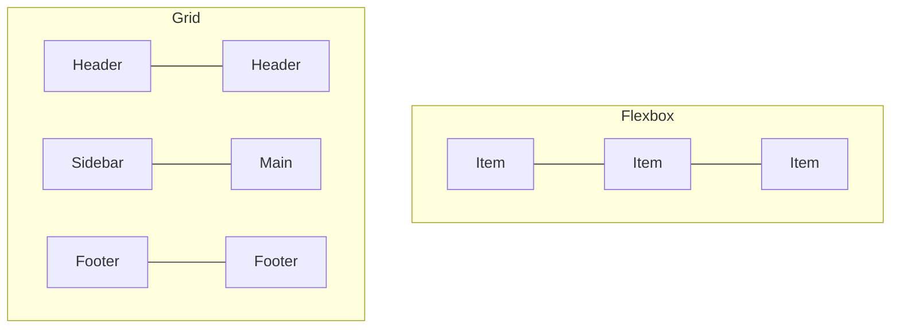

# T08: Layout com CSS

Posicionar elementos numa página costumava ser doloroso. Flexbox e Grid mudaram tudo. Pense em Flexbox como arrumar itens numa única linha (como livros numa estante) e Grid como organizar itens em linhas e colunas (como uma planilha).
{: .lesson-intro }

## Flexbox

Flexbox trabalha uma dimensão por vez. Defina `display: flex` num contêiner e controle como os filhos se alinham e distribuem espaço.

```
.nav {
    display: flex;
    justify-content: space-between;
    align-items: center;
    gap: 1rem;
}

.nav-item {
    flex: 1;
}
```

## CSS Grid

Grid trabalha duas dimensões ao mesmo tempo. Defina linhas e colunas, depois coloque itens nas células da grade.

```
.layout {
    display: grid;
    grid-template-columns: 250px 1fr;
    grid-template-rows: auto 1fr auto;
    gap: 1rem;
    min-height: 100vh;
}
```

## Design Responsivo

Media queries permitem aplicar estilos diferentes conforme o tamanho da tela. Mobile-first significa escrever estilos base para telas pequenas e adicionar complexidade para telas maiores.

```
@media (min-width: 768px) {
    .layout { grid-template-columns: 250px 1fr; }
}
```



<div class="takeaways">
<h2>Pontos-chave</h2>
<ul>
<li>Flexbox serve para layouts unidimensionais (linha ou coluna)</li>
<li>Grid serve para layouts bidimensionais (linhas e colunas juntas)</li>
<li>Use media queries para design responsivo que se adapta ao tamanho da tela</li>
<li>Abordagem mobile-first: comece pequeno, adicione complexidade para telas maiores</li>
</ul>
</div>
