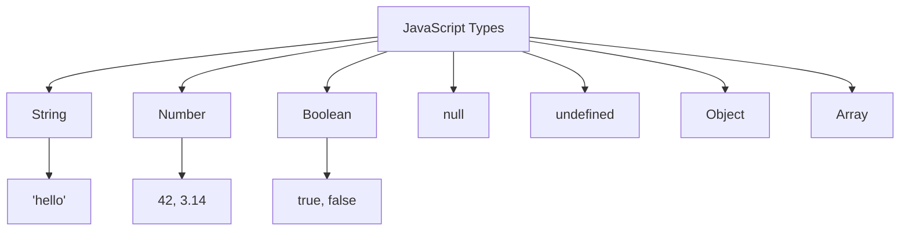

# T10: JavaScript入門

JavaScriptはWebのプログラミング言語です。HTMLが構造、CSSがスタイルなら、JavaScriptは振る舞いです。ページをインタラクティブにし、クリックに応答し、データを処理し、コンテンツを動的に更新します。Webページに考えることを教えるようなものです。 {.lesson-intro}

## コンソールと変数

ブラウザコンソールは練習場です。`console.log()`で値を表示しデバッグします。変数はデータを保存します。

```
// Variables
let name = "Alice";
const age = 25;
let isStudent = true;

console.log("Hello, " + name);
console.log("Age:", age);
```

## データ型

JavaScriptにはいくつかの基本型があります。文字列(テキスト)、数値(計算)、真偽値(true/false)、null(意図的な空)、undefined(未設定)です。

## 関数

関数は再利用可能なコードブロックです。一度定義して何度でも呼び出せます。

```
function greet(name) {
    return "Hello, " + name + "!";
}

const add = (a, b) => a + b;

console.log(greet("Bob"));
console.log(add(3, 4));
```



<div class="takeaways">
<h2>まとめ</h2>
<ul>
<li>変更する変数にはlet、変わらない値にはconstを使います</li>
<li>console.log()はデバッグの最良の味方です</li>
<li>関数は再利用可能なロジックをカプセル化します</li>
<li>アロー関数はシンプルな関数の短い構文を提供します</li>
</ul>
</div>
