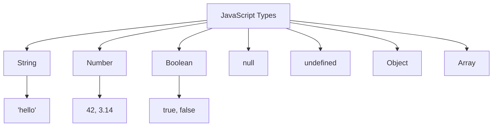

# T10: JavaScript Intro

JavaScript is the programming language of the web. If HTML is the structure and CSS is the style, JavaScript is the behavior. It makes pages interactive - responding to clicks, processing data, and updating content dynamically. Think of it as teaching your web page to think.
{: .lesson-intro }

## Console and Variables

The browser console is your playground. Use `console.log()` to print values and debug. Variables store data for later use.

```
// Variables
let name = "Alice";
const age = 25;
let isStudent = true;

console.log("Hello, " + name);
console.log("Age:", age);
```

## Data Types

JavaScript has several core types: strings for text, numbers for math, booleans for true/false, null for intentional emptiness, and undefined for unset values.

## Functions

Functions are reusable blocks of code. Define once, call many times.

```
function greet(name) {
    return "Hello, " + name + "!";
}

const add = (a, b) => a + b;

console.log(greet("Bob"));
console.log(add(3, 4));
```



<div class="takeaways">
<h2>Key Takeaways</h2>
<ul>
<li>Use let for variables that change, const for values that stay the same</li>
<li>console.log() is your best friend for debugging</li>
<li>Functions encapsulate reusable logic - define once, use many times</li>
<li>Arrow functions provide a shorter syntax for simple functions</li>
</ul>
</div>
