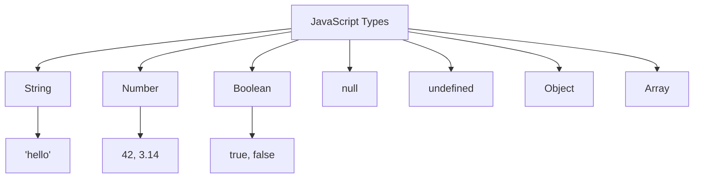

# T10: Introdução ao JavaScript

JavaScript é a linguagem de programação da web. Se HTML é a estrutura e CSS é o estilo, JavaScript é o comportamento. É o que torna as páginas interativas - respondendo a cliques, processando dados e atualizando conteúdo dinamicamente. Pense como ensinar sua página web a pensar.
{: .lesson-intro }

## Console e Variáveis

O console do navegador é seu playground. Use `console.log()` para imprimir valores e depurar. Variáveis guardam dados para uso posterior.

```
// Variables
let name = "Alice";
const age = 25;
let isStudent = true;

console.log("Hello, " + name);
console.log("Age:", age);
```

## Tipos de Dados

JavaScript tem alguns tipos centrais: strings para texto, numbers para contas, booleans para true/false, null para vazio intencional e undefined para valores não definidos.

## Funções

Funções são blocos reutilizáveis de código. Defina uma vez, chame várias vezes.

```
function greet(name) {
    return "Hello, " + name + "!";
}

const add = (a, b) => a + b;

console.log(greet("Bob"));
console.log(add(3, 4));
```



<div class="takeaways">
<h2>Pontos-chave</h2>
<ul>
<li>Use let para variáveis que mudam, const para valores que ficam iguais</li>
<li>console.log() é seu melhor amigo para depurar</li>
<li>Funções encapsulam lógica reutilizável - defina uma vez, use várias</li>
<li>Arrow functions oferecem uma sintaxe mais curta para funções simples</li>
</ul>
</div>
