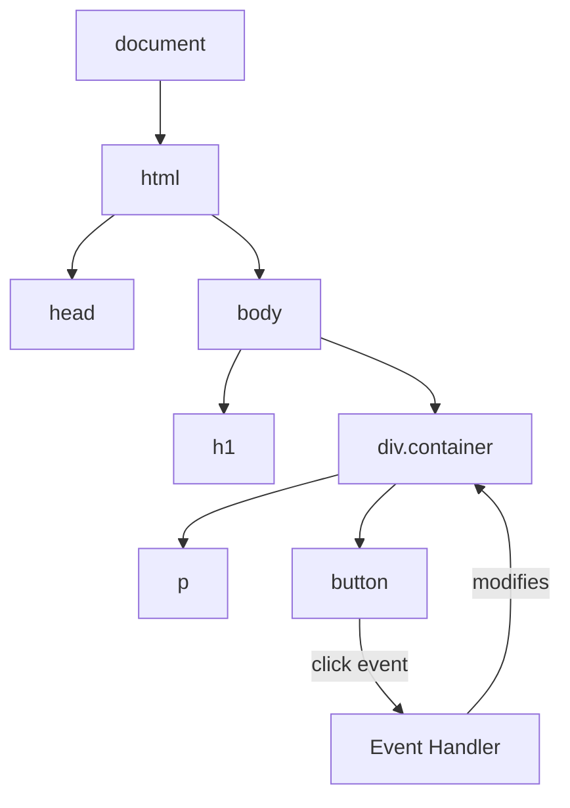

# T11: DOM操作

DOM(ドキュメントオブジェクトモデル)はHTMLページのブラウザ内でのライブ表現です。積み木で作った木のようなもので、JavaScriptでユーザーが見ている間にブロックを追加、削除、並べ替えできます。全ての要素はアクセスして変更できるノードです。 {.lesson-intro}

## 要素の選択

要素を変更するには、まず見つける必要があります。`querySelector`メソッドはCSSセレクタ構文で要素を取得します。

```
const title = document.querySelector("h1");
const items = document.querySelectorAll(".item");
const form = document.querySelector("#signup-form");
```

## 要素の作成と変更

`createElement`で新しい要素を作成し、内容を設定してページに追加します。

```
const card = document.createElement("div");
card.className = "card";
card.textContent = "New card content";
document.querySelector(".container").appendChild(card);
```

## イベント処理

イベントでページがユーザーの操作に応答します。クリック、ホバー、入力、それぞれがリッスンできるイベントを発火します。

```
const button = document.querySelector("#submit");
button.addEventListener("click", function(event) {
    event.preventDefault();
    console.log("Button was clicked!");
});
```



<div class="takeaways">
<h2>まとめ</h2>
<ul>
<li>querySelectorとquerySelectorAllはCSSセレクタ構文で要素を検索します</li>
<li>createElementとappendChildで新しいDOMノードを動的に構築できます</li>
<li>addEventListenerでユーザー操作とJavaScript関数を接続します</li>
<li>デフォルトのブラウザ動作を止めたい時はevent.preventDefault()を使います</li>
</ul>
</div>
