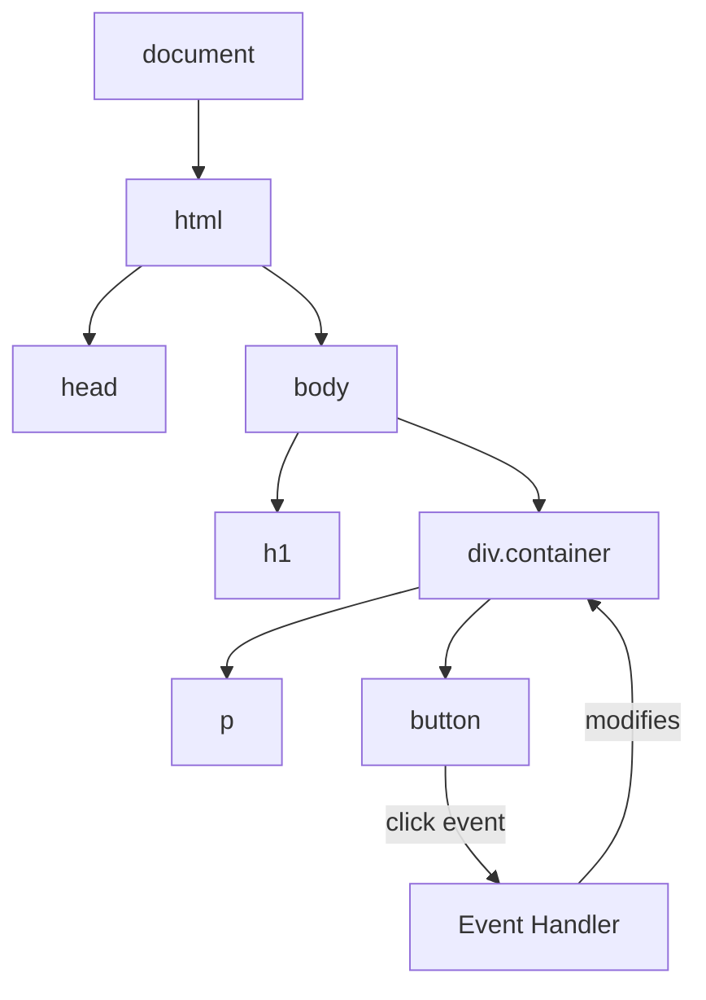

# T11: DOM Manipulation

The DOM (Document Object Model) is the browser's live representation of your HTML page. Think of it as a tree made of building blocks - JavaScript lets you add, remove, and rearrange those blocks while the user watches. Every element is a node you can reach and modify.
{: .lesson-intro }

## Selecting Elements

Before you can change an element, you need to find it. The `querySelector` method uses CSS selector syntax to grab elements.

```
const title = document.querySelector("h1");
const items = document.querySelectorAll(".item");
const form = document.querySelector("#signup-form");
```

## Creating and Modifying Elements

Create new elements with `createElement`, set their content, and append them to the page.

```
const card = document.createElement("div");
card.className = "card";
card.textContent = "New card content";
document.querySelector(".container").appendChild(card);
```

## Event Handling

Events let your page respond to user actions. Click, hover, type - each triggers an event you can listen for.

```
const button = document.querySelector("#submit");
button.addEventListener("click", function(event) {
    event.preventDefault();
    console.log("Button was clicked!");
});
```



<div class="takeaways">
<h2>Key Takeaways</h2>
<ul>
<li>querySelector and querySelectorAll find elements using CSS selector syntax</li>
<li>createElement and appendChild let you build new DOM nodes dynamically</li>
<li>addEventListener connects user actions to your JavaScript functions</li>
<li>Always use event.preventDefault() when you want to stop default browser behavior</li>
</ul>
</div>
