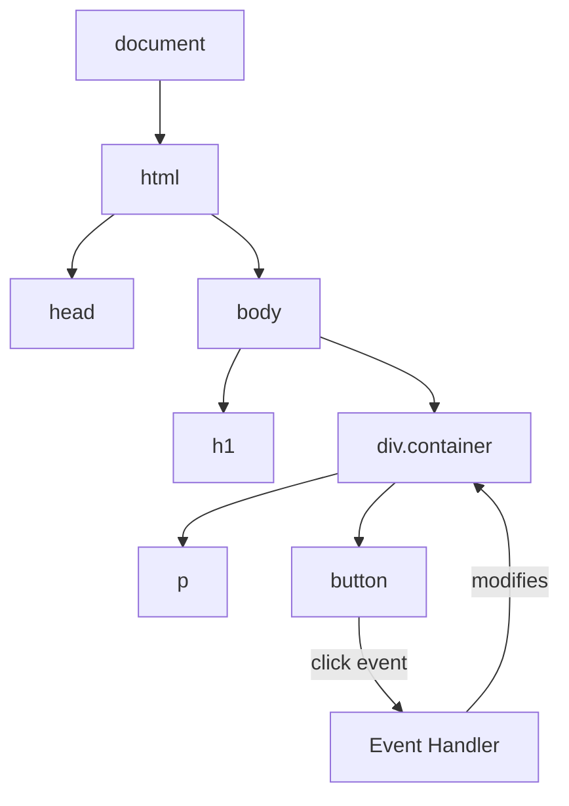

# T11: Manipulação do DOM

O DOM (Document Object Model) é a representação viva do navegador da sua página HTML. Pense numa árvore feita de blocos de construção - o JavaScript deixa você adicionar, remover e rearranjar esses blocos enquanto o usuário assiste. Cada elemento é um nó que você pode alcançar e modificar.
{: .lesson-intro }

## Selecionando Elementos

Antes de mudar um elemento, você precisa encontrá-lo. O método `querySelector` usa sintaxe de seletor CSS para pegar elementos.

```
const title = document.querySelector("h1");
const items = document.querySelectorAll(".item");
const form = document.querySelector("#signup-form");
```

## Criando e Modificando Elementos

Crie novos elementos com `createElement`, defina o conteúdo e anexe à página.

```
const card = document.createElement("div");
card.className = "card";
card.textContent = "New card content";
document.querySelector(".container").appendChild(card);
```

## Tratando Eventos

Eventos permitem que sua página responda às ações do usuário. Clicar, passar o mouse, digitar - cada um dispara um evento que você pode escutar.

```
const button = document.querySelector("#submit");
button.addEventListener("click", function(event) {
    event.preventDefault();
    console.log("Button was clicked!");
});
```



<div class="takeaways">
<h2>Pontos-chave</h2>
<ul>
<li>querySelector e querySelectorAll encontram elementos usando sintaxe de seletor CSS</li>
<li>createElement e appendChild permitem construir novos nós do DOM dinamicamente</li>
<li>addEventListener conecta ações do usuário às suas funções JavaScript</li>
<li>Sempre use event.preventDefault() quando quiser impedir o comportamento padrão do navegador</li>
</ul>
</div>
