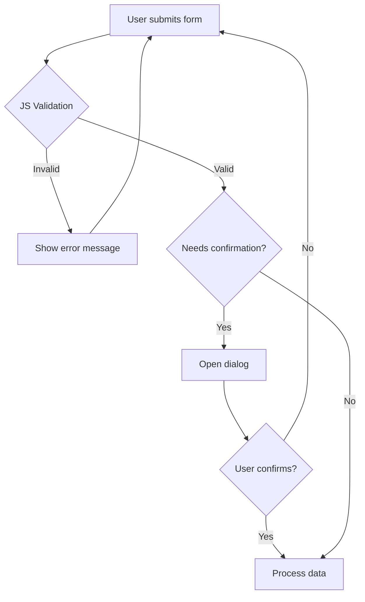

# T12: フォームとダイアログ

HTMLフォームはデータを収集しますが、JavaScriptがそれを検証・処理します。dialog要素はライブラリなしでネイティブモーダルウィンドウを提供します。この組み合わせでスムーズなデータ収集体験を作れます。書類を提出する前にチェックしてくれる賢い受付のようなものです。
{: .lesson-intro }

## JavaScriptフォームバリデーション

HTMLには組み込みバリデーション(required, type)がありますが、JavaScriptはバリデーションロジックとカスタムエラーメッセージを完全に制御できます。

```
const form = document.querySelector("#myForm");
form.addEventListener("submit", function(event) {
    const email = form.querySelector("#email").value;
    if (!email.includes("@")) {
        event.preventDefault();
        showError("Please enter a valid email address.");
    }
});

function showError(message) {
    const errorDiv = document.querySelector(".error");
    errorDiv.textContent = message;
    errorDiv.style.display = "block";
}
```

## Dialog要素

`<dialog>`要素はネイティブのモーダル/非モーダルダイアログを提供します。`showModal()`で背景付きモーダル、`show()`で非モーダルを表示します。

```
<dialog id="confirm">
    <p>Are you sure?</p>
    <button id="yes">Yes</button>
    <button id="no">No</button>
</dialog>

<script>
const dialog = document.querySelector("#confirm");
dialog.showModal();
dialog.querySelector("#no").addEventListener("click", () => dialog.close());
</script>
```



<div class="takeaways">
<h2>まとめ</h2>
<ul>
<li>JavaScriptバリデーションはHTML5組み込みバリデーション以上のカスタムロジックを提供します</li>
<li>dialog要素は外部ライブラリなしでネイティブモーダルウィンドウを提供します</li>
<li>モーダルにはshowModal()、非モーダルにはshow()を使います</li>
<li>ユーザーに問題の修正方法を伝える明確なエラーメッセージを必ず提供しましょう</li>
</ul>
</div>
