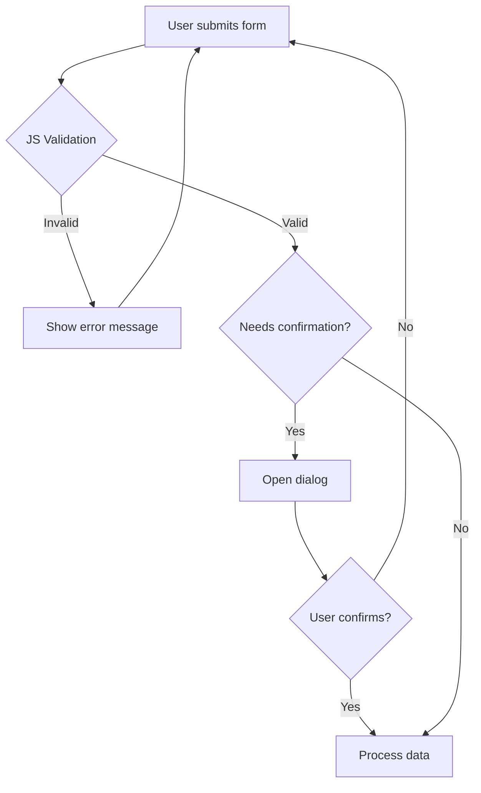

# T12: Forms and Dialog

HTML forms collect data, but JavaScript validates and processes it. The dialog element gives you native modal windows without any library. Together they create a smooth data collection experience - like a smart receptionist who checks your paperwork before filing it.
{: .lesson-intro }

## JavaScript Form Validation

While HTML has built-in validation (required, type), JavaScript gives you full control over validation logic and custom error messages.

```
const form = document.querySelector("#myForm");
form.addEventListener("submit", function(event) {
    const email = form.querySelector("#email").value;
    if (!email.includes("@")) {
        event.preventDefault();
        showError("Please enter a valid email address.");
    }
});

function showError(message) {
    const errorDiv = document.querySelector(".error");
    errorDiv.textContent = message;
    errorDiv.style.display = "block";
}
```

## The Dialog Element

The `<dialog>` element provides native modal and non-modal dialogs. Use `showModal()` for modals with backdrop, or `show()` for non-modal.

```
<dialog id="confirm">
    <p>Are you sure?</p>
    <button id="yes">Yes</button>
    <button id="no">No</button>
</dialog>

<script>
const dialog = document.querySelector("#confirm");
dialog.showModal();
dialog.querySelector("#no").addEventListener("click", () => dialog.close());
</script>
```



<div class="takeaways">
<h2>Key Takeaways</h2>
<ul>
<li>JavaScript validation gives you custom logic beyond HTML5 built-in validation</li>
<li>The dialog element provides native modal windows without external libraries</li>
<li>Use showModal() for modal dialogs and show() for non-modal ones</li>
<li>Always provide clear error messages that tell users how to fix the problem</li>
</ul>
</div>
