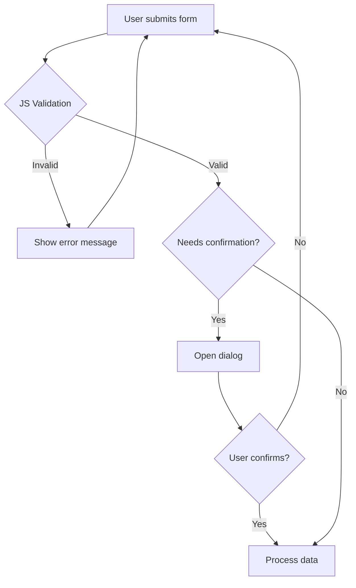

# T12: Formulários e Dialog

Formulários HTML coletam dados, mas o JavaScript os valida e processa. O elemento dialog dá janelas modais nativas sem biblioteca alguma. Juntos criam uma experiência de coleta de dados fluida - como uma recepcionista esperta que confere seus papéis antes de arquivar.
{: .lesson-intro }

## Validação de Formulário com JavaScript

Enquanto o HTML tem validação embutida (required, type), o JavaScript te dá controle total sobre a lógica de validação e mensagens de erro personalizadas.

```
const form = document.querySelector("#myForm");
form.addEventListener("submit", function(event) {
    const email = form.querySelector("#email").value;
    if (!email.includes("@")) {
        event.preventDefault();
        showError("Please enter a valid email address.");
    }
});

function showError(message) {
    const errorDiv = document.querySelector(".error");
    errorDiv.textContent = message;
    errorDiv.style.display = "block";
}
```

## O Elemento Dialog

O elemento `<dialog>` oferece diálogos modais e não modais nativos. Use `showModal()` para modais com fundo, ou `show()` para não modal.

```
<dialog id="confirm">
    <p>Are you sure?</p>
    <button id="yes">Yes</button>
    <button id="no">No</button>
</dialog>

<script>
const dialog = document.querySelector("#confirm");
dialog.showModal();
dialog.querySelector("#no").addEventListener("click", () => dialog.close());
</script>
```



<div class="takeaways">
<h2>Key Takeaways</h2>
<ul>
<li>Validação em JavaScript te dá lógica personalizada além da validação embutida do HTML5</li>
<li>O elemento dialog oferece janelas modais nativas sem bibliotecas externas</li>
<li>Use showModal() para diálogos modais e show() para não modais</li>
<li>Sempre forneça mensagens de erro claras que dizem ao usuário como consertar o problema</li>
</ul>
</div>
