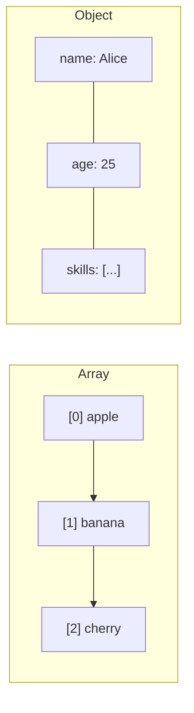

# T13: データ構造

データ構造は情報を整理するための入れ物です。配列は順序が重要な番号付きリストです。オブジェクトは名前で情報を検索するラベル付きファイルキャビネットです。適切な構造を選ぶことでコードがシンプルかつ高速になります。
{: .lesson-intro }

## 配列

配列は順序付きコレクションを格納します。インデックス(0から開始)でアイテムにアクセスします。配列にはデータ変換のための強力な組み込みメソッドがあります。

```
const fruits = ["apple", "banana", "cherry"];
console.log(fruits[0]); // "apple"
fruits.push("date");

// Transform with map, filter, reduce
const prices = [10, 20, 30, 40];
const expensive = prices.filter(p => p > 15);
const doubled = prices.map(p => p * 2);
const total = prices.reduce((sum, p) => sum + p, 0);
```

## オブジェクト

オブジェクトはキーと値のペアを格納します。キーは文字列(またはシンボル)、値は何でも可能です。

```
const user = {
    name: "Alice",
    age: 25,
    skills: ["HTML", "CSS", "JS"],
    greet() {
        return "Hi, I am " + this.name;
    }
};
console.log(user.name);
console.log(user["age"]);
```

## ループ

配列は`for...of`で、オブジェクトは`for...in`や`Object.entries()`で反復処理します。

```
for (const fruit of fruits) { console.log(fruit); }
for (const [key, value] of Object.entries(user)) { console.log(key, value); }
```



<div class="takeaways">
<h2>まとめ</h2>
<ul>
<li>配列は0から始まるインデックスでアクセスする順序付きリストです</li>
<li>オブジェクトは文字列キーでアクセスするキーバリューストアです</li>
<li>map、filter、reduceで配列を変更せずに変換できます</li>
<li>for...ofは配列の値を、for...inはオブジェクトのキーを反復処理します</li>
</ul>
</div>
