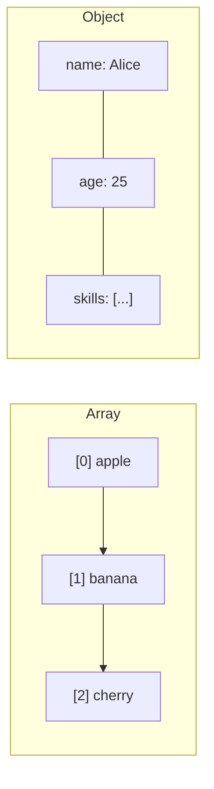

# T13: Data Structures

Data structures are containers for organizing information. Arrays are like numbered lists where order matters. Objects are like labeled filing cabinets where you look up information by name. Choosing the right structure makes your code simpler and faster.
{: .lesson-intro }

## Arrays

Arrays store ordered collections. Access items by their index (starting from 0). Arrays have powerful built-in methods for transforming data.

```
const fruits = ["apple", "banana", "cherry"];
console.log(fruits[0]); // "apple"
fruits.push("date");

// Transform with map, filter, reduce
const prices = [10, 20, 30, 40];
const expensive = prices.filter(p => p > 15);
const doubled = prices.map(p => p * 2);
const total = prices.reduce((sum, p) => sum + p, 0);
```

## Objects

Objects store key-value pairs. Keys are strings (or symbols), values can be anything.

```
const user = {
    name: "Alice",
    age: 25,
    skills: ["HTML", "CSS", "JS"],
    greet() {
        return "Hi, I am " + this.name;
    }
};
console.log(user.name);
console.log(user["age"]);
```

## Loops

Iterate over arrays with `for...of` and objects with `for...in` or `Object.entries()`.

```
for (const fruit of fruits) { console.log(fruit); }
for (const [key, value] of Object.entries(user)) { console.log(key, value); }
```



<div class="takeaways">
<h2>Key Takeaways</h2>
<ul>
<li>Arrays are ordered lists accessed by numeric index starting at 0</li>
<li>Objects are key-value stores accessed by string keys</li>
<li>Use map, filter, and reduce to transform arrays without mutating them</li>
<li>for...of iterates array values, for...in iterates object keys</li>
</ul>
</div>
