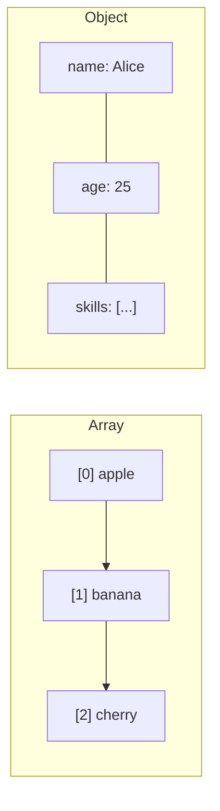

# T13: Estruturas de Dados

Estruturas de dados são contêineres para organizar informação. Arrays são como listas numeradas onde a ordem importa. Objetos são como arquivos com etiquetas onde você consulta a informação por nome. Escolher a estrutura certa deixa seu código mais simples e rápido.
{: .lesson-intro }

## Arrays

Arrays armazenam coleções ordenadas. Acesse itens pelo índice (começando em 0). Arrays têm métodos embutidos poderosos para transformar dados.

```
const fruits = ["apple", "banana", "cherry"];
console.log(fruits[0]); // "apple"
fruits.push("date");

// Transform with map, filter, reduce
const prices = [10, 20, 30, 40];
const expensive = prices.filter(p => p > 15);
const doubled = prices.map(p => p * 2);
const total = prices.reduce((sum, p) => sum + p, 0);
```

## Objetos

Objetos armazenam pares chave-valor. Chaves são strings (ou símbolos), valores podem ser qualquer coisa.

```
const user = {
    name: "Alice",
    age: 25,
    skills: ["HTML", "CSS", "JS"],
    greet() {
        return "Hi, I am " + this.name;
    }
};
console.log(user.name);
console.log(user["age"]);
```

## Loops

Itere sobre arrays com `for...of` e sobre objetos com `for...in` ou `Object.entries()`.

```
for (const fruit of fruits) { console.log(fruit); }
for (const [key, value] of Object.entries(user)) { console.log(key, value); }
```



<div class="takeaways">
<h2>Key Takeaways</h2>
<ul>
<li>Arrays são listas ordenadas acessadas por índice numérico começando em 0</li>
<li>Objetos são armazéns chave-valor acessados por chaves string</li>
<li>Use map, filter e reduce para transformar arrays sem mutá-los</li>
<li>for...of itera valores de array, for...in itera chaves de objeto</li>
</ul>
</div>
