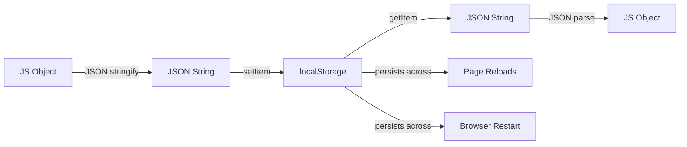

# T14: データの永続化

Webページは閉じると全てを忘れます。localStorageはブラウザがあなたのWebサイト用に保持するノートのようなものです。タブを閉じてもデータは残ります。JSONはJavaScriptオブジェクトを保存可能な文字列に変換し、元に戻すための共通形式です。 {.lesson-intro}

## localStorage API

localStorageはキーバリューペアを文字列として格納します。ページのリロードやブラウザの再起動後も持続し、ドメインあたり約5MBの容量があります。

```
// Save data
localStorage.setItem("username", "Alice");

// Read data
const name = localStorage.getItem("username");

// Remove data
localStorage.removeItem("username");

// Clear all
localStorage.clear();
```

## JSONの活用

localStorageは文字列のみ格納するため、`JSON.stringify()`でオブジェクトを保存し、`JSON.parse()`で読み戻します。

```
const tasks = [
    { id: 1, text: "Learn HTML", done: true },
    { id: 2, text: "Learn CSS", done: false }
];

// Save
localStorage.setItem("tasks", JSON.stringify(tasks));

// Load
const saved = JSON.parse(localStorage.getItem("tasks") || "[]");
```



<div class="takeaways">
<h2>まとめ</h2>
<ul>
<li>localStorageはページリロードやブラウザ再起動後もデータを保持します</li>
<li>全ての値は文字列として格納されます。複雑なデータにはJSONを使います</li>
<li>JSON.stringifyでオブジェクトを文字列に、JSON.parseで元に戻します</li>
<li>localStorageはドメインあたり5MB制限があります。小さなデータ専用です</li>
</ul>
</div>
