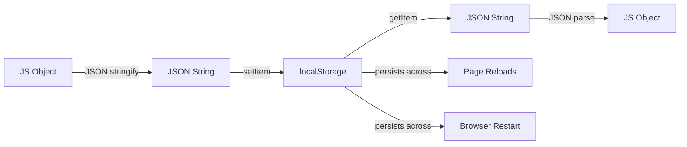

# T14: Persistence

Web pages forget everything when you close them. LocalStorage is like a notebook the browser keeps for your website - data persists even after closing the tab. JSON is the universal format for converting JavaScript objects into storable strings and back.
{: .lesson-intro }

## localStorage API

LocalStorage stores key-value pairs as strings. It persists across page reloads and browser restarts, with about 5MB of space per domain.

```
// Save data
localStorage.setItem("username", "Alice");

// Read data
const name = localStorage.getItem("username");

// Remove data
localStorage.removeItem("username");

// Clear all
localStorage.clear();
```

## Working with JSON

Since localStorage only stores strings, use `JSON.stringify()` to save objects and `JSON.parse()` to read them back.

```
const tasks = [
    { id: 1, text: "Learn HTML", done: true },
    { id: 2, text: "Learn CSS", done: false }
];

// Save
localStorage.setItem("tasks", JSON.stringify(tasks));

// Load
const saved = JSON.parse(localStorage.getItem("tasks") || "[]");
```



<div class="takeaways">
<h2>Key Takeaways</h2>
<ul>
<li>localStorage persists data across page reloads and browser restarts</li>
<li>All values are stored as strings - use JSON for complex data</li>
<li>JSON.stringify converts objects to strings, JSON.parse converts back</li>
<li>localStorage has a 5MB limit per domain - use it for small data only</li>
</ul>
</div>
