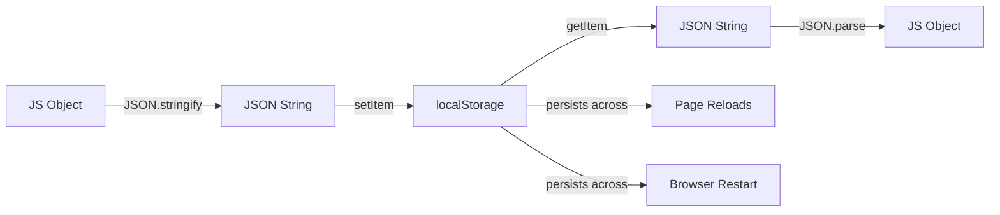

# T14: Persistência

Páginas web esquecem tudo quando você fecha. O localStorage é como um caderno que o navegador mantém para seu site - os dados persistem mesmo depois de fechar a aba. JSON é o formato universal para converter objetos JavaScript em strings armazenáveis e de volta.
{: .lesson-intro }

## API localStorage

O localStorage armazena pares chave-valor como strings. Persiste entre recargas de página e reinícios do navegador, com cerca de 5MB de espaço por domínio.

```
// Save data
localStorage.setItem("username", "Alice");

// Read data
const name = localStorage.getItem("username");

// Remove data
localStorage.removeItem("username");

// Clear all
localStorage.clear();
```

## Trabalhando com JSON

Como o localStorage só armazena strings, use `JSON.stringify()` para salvar objetos e `JSON.parse()` para ler de volta.

```
const tasks = [
    { id: 1, text: "Learn HTML", done: true },
    { id: 2, text: "Learn CSS", done: false }
];

// Save
localStorage.setItem("tasks", JSON.stringify(tasks));

// Load
const saved = JSON.parse(localStorage.getItem("tasks") || "[]");
```



<div class="takeaways">
<h2>Pontos-chave</h2>
<ul>
<li>localStorage persiste dados entre recargas de página e reinícios do navegador</li>
<li>Todos os valores são armazenados como strings - use JSON para dados complexos</li>
<li>JSON.stringify converte objetos para strings, JSON.parse converte de volta</li>
<li>localStorage tem limite de 5MB por domínio - use só para dados pequenos</li>
</ul>
</div>
