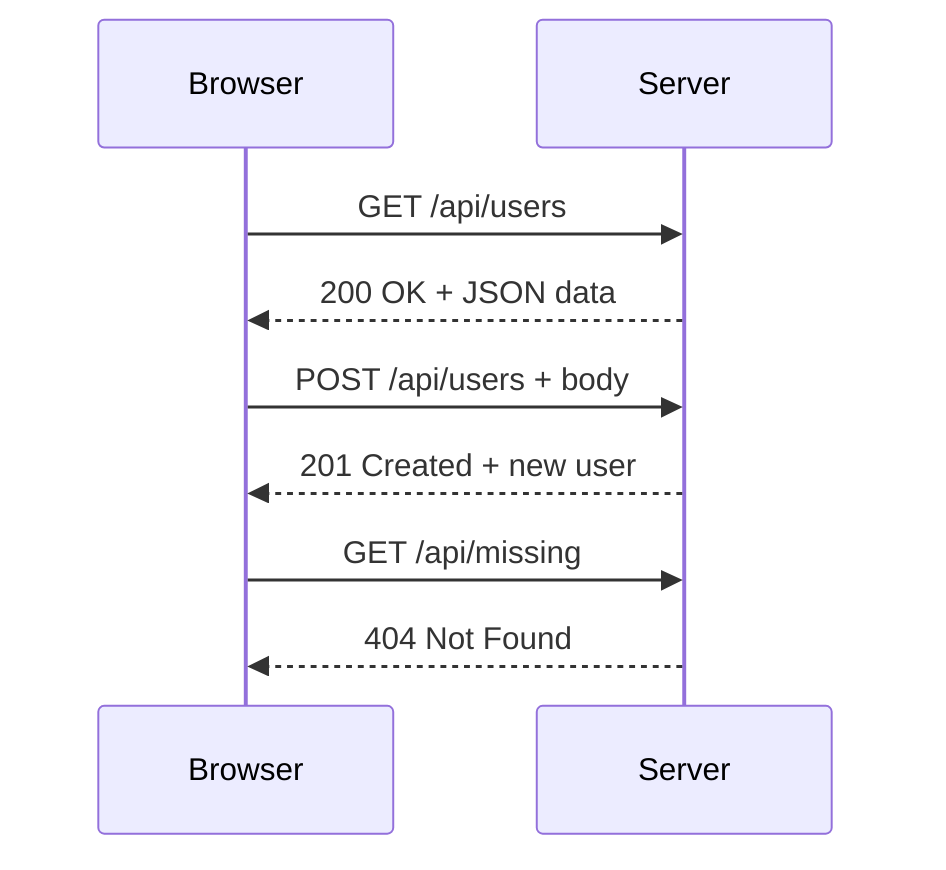

# T15: Fetch API

Fetch APIはJavaScriptからサーバーと通信する手段です。手紙を送って返事を待つようなもので、リクエストを送り、サーバーが処理し、レスポンスを返します。async/await構文でこの非同期通信を同期的なコードのように読めるようにします。 {.lesson-intro}

## HTTPの基本

HTTPはブラウザがサーバーと通信するプロトコルです。全てのリクエストにはメソッド(GET, POST, PUT, DELETE)があり、全てのレスポンスにはステータスコード(200 OK, 404 Not Found, 500 Error)があります。

## リクエストの送信

`fetch()`関数はPromiseを返します。`async/await`でクリーンで読みやすい非同期コードを書けます。

```
// GET request
async function getUsers() {
    const response = await fetch("/api/users");
    const data = await response.json();
    return data;
}

// POST request
async function createUser(user) {
    const response = await fetch("/api/users", {
        method: "POST",
        headers: { "Content-Type": "application/json" },
        body: JSON.stringify(user)
    });
    return await response.json();
}
```

## エラー処理

```
try {
    const data = await getUsers();
    renderUsers(data);
} catch (error) {
    console.error("Failed to fetch:", error);
    showErrorMessage("Could not load users. Try again.");
}
```



<div class="takeaways">
<h2>まとめ</h2>
<ul>
<li>fetch()はHTTPリクエストを送信しPromiseを返します</li>
<li>async/awaitで非同期コードが読みやすく保守しやすくなります</li>
<li>ネットワークリクエストではtry/catchで必ずエラー処理をしましょう</li>
<li>response.json()でJSONレスポンスボディをパースします</li>
</ul>
</div>
