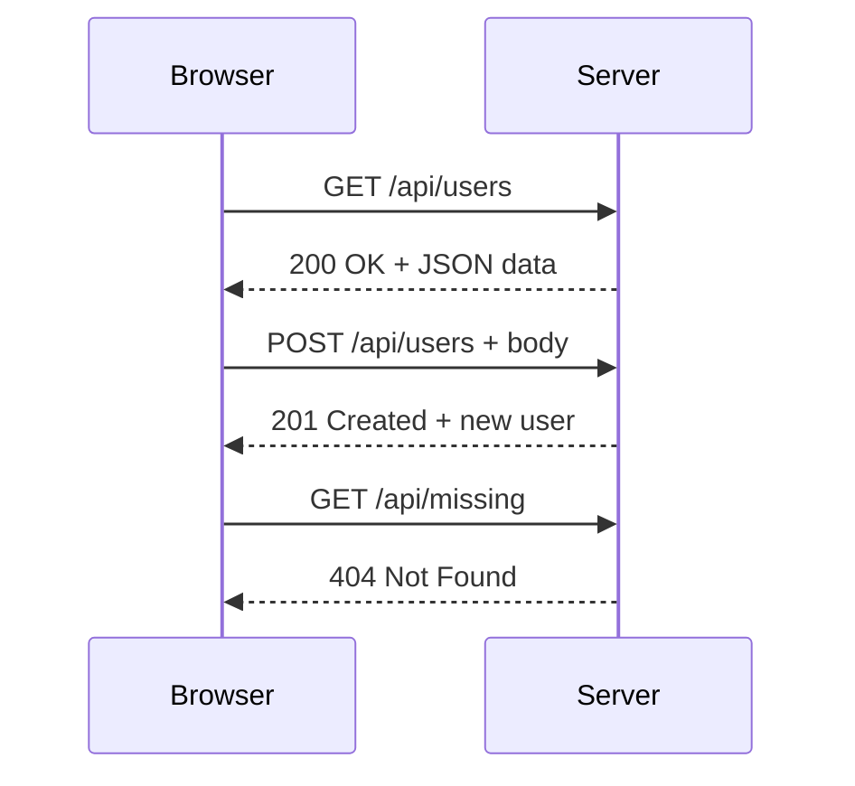

# T15: Fetch API

The Fetch API lets your JavaScript talk to servers. It is like sending a letter and waiting for a reply - you make a request, the server processes it, and sends back a response. The async/await syntax makes this asynchronous communication read like synchronous code.
{: .lesson-intro }

## HTTP Basics

HTTP is the protocol browsers use to communicate with servers. Every request has a method (GET, POST, PUT, DELETE) and every response has a status code (200 OK, 404 Not Found, 500 Error).

## Making Requests

The `fetch()` function returns a Promise. Use `async/await` for clean, readable asynchronous code.

```
// GET request
async function getUsers() {
    const response = await fetch("/api/users");
    const data = await response.json();
    return data;
}

// POST request
async function createUser(user) {
    const response = await fetch("/api/users", {
        method: "POST",
        headers: { "Content-Type": "application/json" },
        body: JSON.stringify(user)
    });
    return await response.json();
}
```

## Error Handling

```
try {
    const data = await getUsers();
    renderUsers(data);
} catch (error) {
    console.error("Failed to fetch:", error);
    showErrorMessage("Could not load users. Try again.");
}
```



<div class="takeaways">
<h2>Key Takeaways</h2>
<ul>
<li>fetch() sends HTTP requests and returns Promises</li>
<li>async/await makes asynchronous code readable and maintainable</li>
<li>Always handle errors with try/catch when making network requests</li>
<li>Use response.json() to parse JSON response bodies</li>
</ul>
</div>
