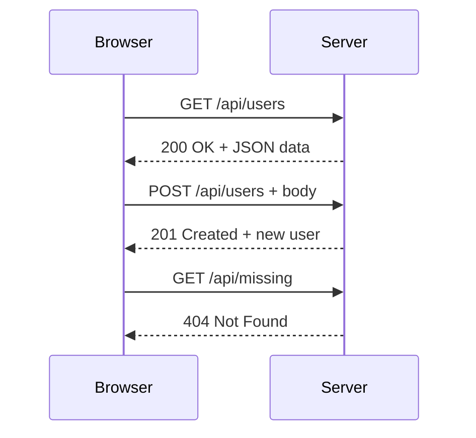

# T15: Fetch API

A Fetch API deixa seu JavaScript conversar com servidores. É como enviar uma carta e esperar resposta - você faz uma requisição, o servidor a processa e devolve uma resposta. A sintaxe async/await faz essa comunicação assíncrona parecer código síncrono.
{: .lesson-intro }

## Básico de HTTP

HTTP é o protocolo que navegadores usam para se comunicar com servidores. Toda requisição tem um método (GET, POST, PUT, DELETE) e toda resposta tem um código de status (200 OK, 404 Not Found, 500 Error).

## Fazendo Requisições

A função `fetch()` retorna uma Promise. Use `async/await` para código assíncrono limpo e legível.

```
// GET request
async function getUsers() {
    const response = await fetch("/api/users");
    const data = await response.json();
    return data;
}

// POST request
async function createUser(user) {
    const response = await fetch("/api/users", {
        method: "POST",
        headers: { "Content-Type": "application/json" },
        body: JSON.stringify(user)
    });
    return await response.json();
}
```

## Tratamento de Erros

```
try {
    const data = await getUsers();
    renderUsers(data);
} catch (error) {
    console.error("Failed to fetch:", error);
    showErrorMessage("Could not load users. Try again.");
}
```



<div class="takeaways">
<h2>Pontos-chave</h2>
<ul>
<li>fetch() envia requisições HTTP e retorna Promises</li>
<li>async/await deixa código assíncrono legível e sustentável</li>
<li>Sempre trate erros com try/catch ao fazer requisições de rede</li>
<li>Use response.json() para parsear corpos de resposta JSON</li>
</ul>
</div>
