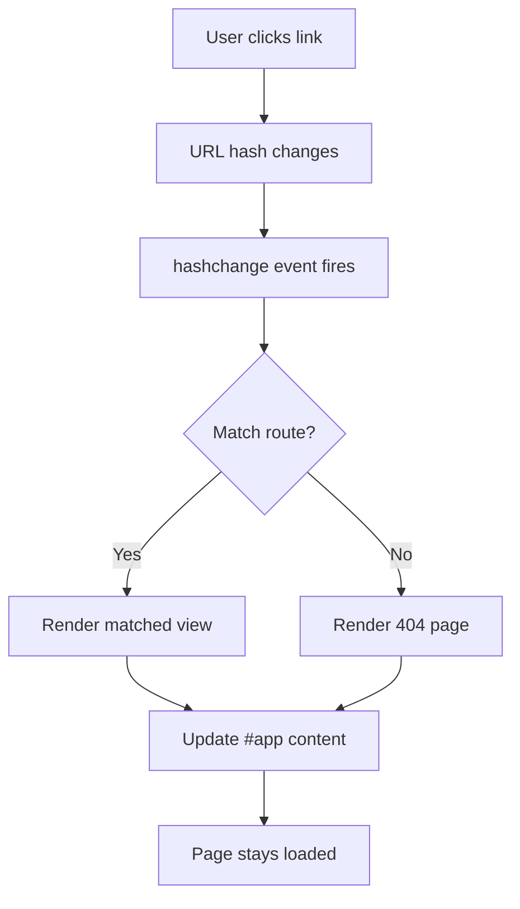

# T16: 動的サイト - ルーティング

従来のWebサイトでは各ページが別々のHTMLファイルです。シングルページアプリケーション(SPA)は一度読み込んでコンテンツを動的に入れ替えます。ハッシュルーティングはURLフラグメント(#の後の部分)でどのビューを表示するか決定します。新しい本を取りに行かずにページをめくるようなものです。 {.lesson-intro}

## ハッシュベースルーティング

URLのハッシュ部分(#の後)はページリロードを引き起こしません。ハッシュの変更をリッスンして異なるコンテンツを描画できます。

```
const routes = {
    "#/": renderHome,
    "#/about": renderAbout,
    "#/contact": renderContact
};

function router() {
    const hash = window.location.hash || "#/";
    const renderFn = routes[hash] || renderNotFound;
    renderFn();
}

window.addEventListener("hashchange", router);
window.addEventListener("load", router);
```

## 動的コンテンツ描画

```
function renderHome() {
    document.querySelector("#app").innerHTML = `
        <h1>Home</h1>
        <p>Welcome to the site.</p>
        <a href="#/about">About Us</a>
    `;
}
```



<div class="takeaways">
<h2>まとめ</h2>
<ul>
<li>SPAは1つのHTMLファイルを読み込み、JavaScriptでコンテンツを動的に入れ替えます</li>
<li>ハッシュルーティングはURLフラグメントでどのビューを表示するか決定します</li>
<li>hashchangeイベントはURLハッシュが変わるたびに発火します</li>
<li>ルートマップオブジェクトがハッシュパターンと描画関数を接続します</li>
</ul>
</div>
