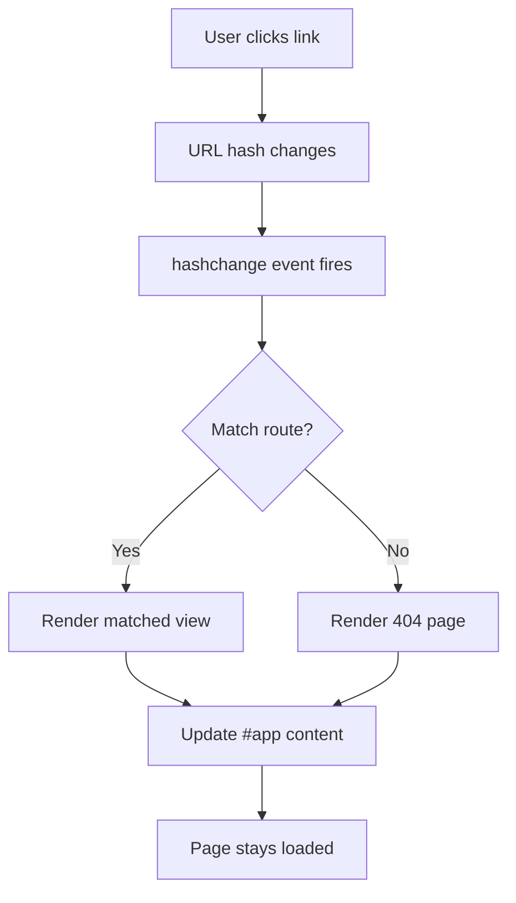

# T16: Dynamic Site - Routing

In a traditional website, each page is a separate HTML file. A Single Page Application (SPA) loads once and swaps content dynamically. Hash routing uses the URL fragment (the part after #) to determine which view to show - like chapters in a book that you flip to without getting a new book. {.lesson-intro}

## Hash-Based Routing

The hash portion of the URL (after #) does not trigger a page reload. We can listen for hash changes and render different content.

```
const routes = {
    "#/": renderHome,
    "#/about": renderAbout,
    "#/contact": renderContact
};

function router() {
    const hash = window.location.hash || "#/";
    const renderFn = routes[hash] || renderNotFound;
    renderFn();
}

window.addEventListener("hashchange", router);
window.addEventListener("load", router);
```

## Dynamic Content Rendering

```
function renderHome() {
    document.querySelector("#app").innerHTML = `
        <h1>Home</h1>
        <p>Welcome to the site.</p>
        <a href="#/about">About Us</a>
    `;
}
```



<div class="takeaways">
<h2>Key Takeaways</h2>
<ul>
<li>SPAs load one HTML file and swap content dynamically via JavaScript</li>
<li>Hash routing uses the URL fragment to determine which view to display</li>
<li>The hashchange event fires whenever the URL hash changes</li>
<li>A route map object connects hash patterns to render functions</li>
</ul>
</div>
