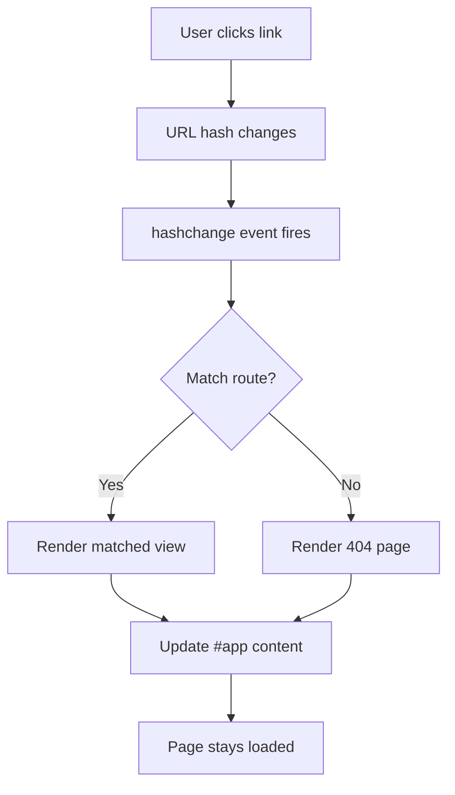

# T16: Site Dinâmico - Roteamento

Num site tradicional, cada página é um arquivo HTML separado. Uma Single Page Application (SPA) carrega uma vez e troca o conteúdo dinamicamente. Hash routing usa o fragmento da URL (a parte depois do #) para determinar qual visualização mostrar - como capítulos de um livro que você vai folheando sem pegar um livro novo.
{: .lesson-intro }

## Roteamento por Hash

A parte do hash da URL (depois do #) não dispara recarga da página. Podemos escutar mudanças no hash e renderizar conteúdo diferente.

```
const routes = {
    "#/": renderHome,
    "#/about": renderAbout,
    "#/contact": renderContact
};

function router() {
    const hash = window.location.hash || "#/";
    const renderFn = routes[hash] || renderNotFound;
    renderFn();
}

window.addEventListener("hashchange", router);
window.addEventListener("load", router);
```

## Renderização Dinâmica de Conteúdo

```
function renderHome() {
    document.querySelector("#app").innerHTML = `
        <h1>Home</h1>
        <p>Welcome to the site.</p>
        <a href="#/about">About Us</a>
    `;
}
```



<div class="takeaways">
<h2>Pontos-chave</h2>
<ul>
<li>SPAs carregam um arquivo HTML e trocam o conteúdo dinamicamente via JavaScript</li>
<li>Hash routing usa o fragmento da URL para decidir qual visualização mostrar</li>
<li>O evento hashchange dispara sempre que o hash da URL muda</li>
<li>Um objeto de mapa de rotas conecta padrões de hash a funções de renderização</li>
</ul>
</div>
