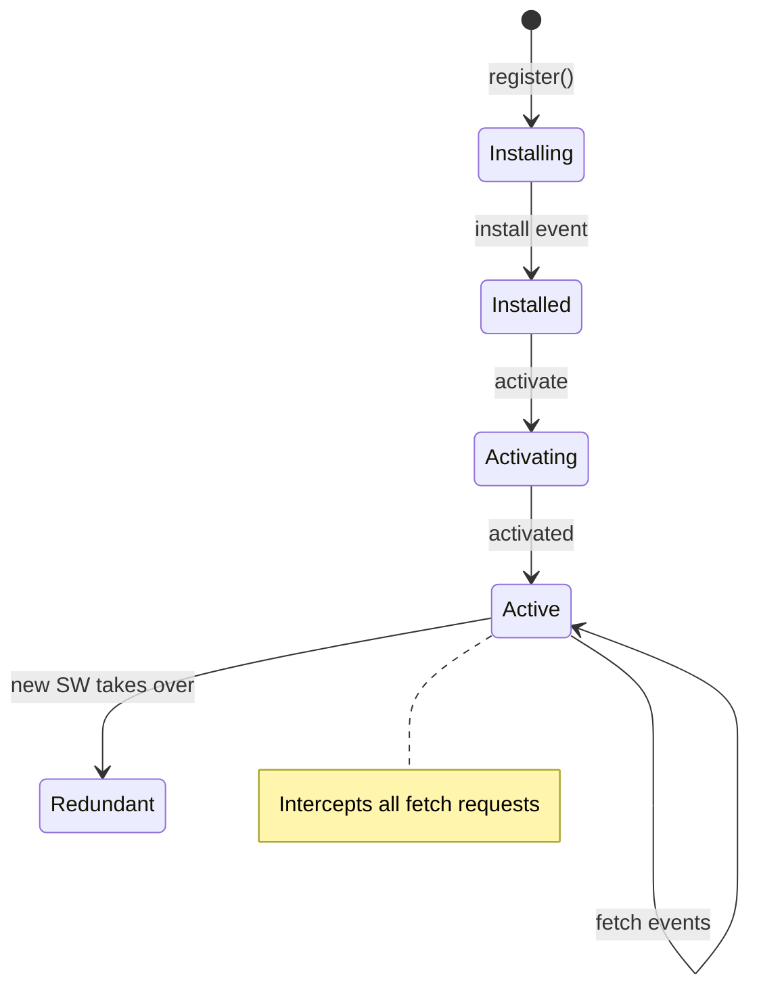

# T17: 動的サイト - オフライン対応

Service Workerはバックグラウンドで動作するスクリプトで、Webページとは別に実行されます。ネットワークリクエストを傍受し、オフライン時にキャッシュからレスポンスを返せます。ブラウザ内に住むプログラム可能なプロキシサーバーと考えてください。ネットワークから取得するかキャッシュから返すかを判断します。
{: .lesson-intro }

## Service Workerの登録

```
// In your main JS file
if ("serviceWorker" in navigator) {
    navigator.serviceWorker.register("/sw.js")
        .then(reg => console.log("SW registered"))
        .catch(err => console.error("SW failed:", err));
}
```

## Service Workerファイル

```
// sw.js
const CACHE_NAME = "v1";
const ASSETS = ["/", "/index.html", "/style.css", "/app.js"];

self.addEventListener("install", event => {
    event.waitUntil(
        caches.open(CACHE_NAME)
            .then(cache => cache.addAll(ASSETS))
    );
});

self.addEventListener("fetch", event => {
    event.respondWith(
        caches.match(event.request)
            .then(cached => cached || fetch(event.request))
    );
});
```

## PWAマニフェスト

`manifest.json`ファイルを追加してモバイルデバイスでアプリとしてインストール可能にします。



<div class="takeaways">
<h2>まとめ</h2>
<ul>
<li>Service Workerはバックグラウンドで実行され、ネットワークリクエストを傍受します</li>
<li>インストール時にアセットをキャッシュしてオフライン機能を有効にします</li>
<li>fetchイベントハンドラがキャッシュから返すかネットワークから取得するかを決定します</li>
<li>manifest.jsonファイルでWebアプリをモバイルデバイスにインストール可能にします</li>
</ul>
</div>
