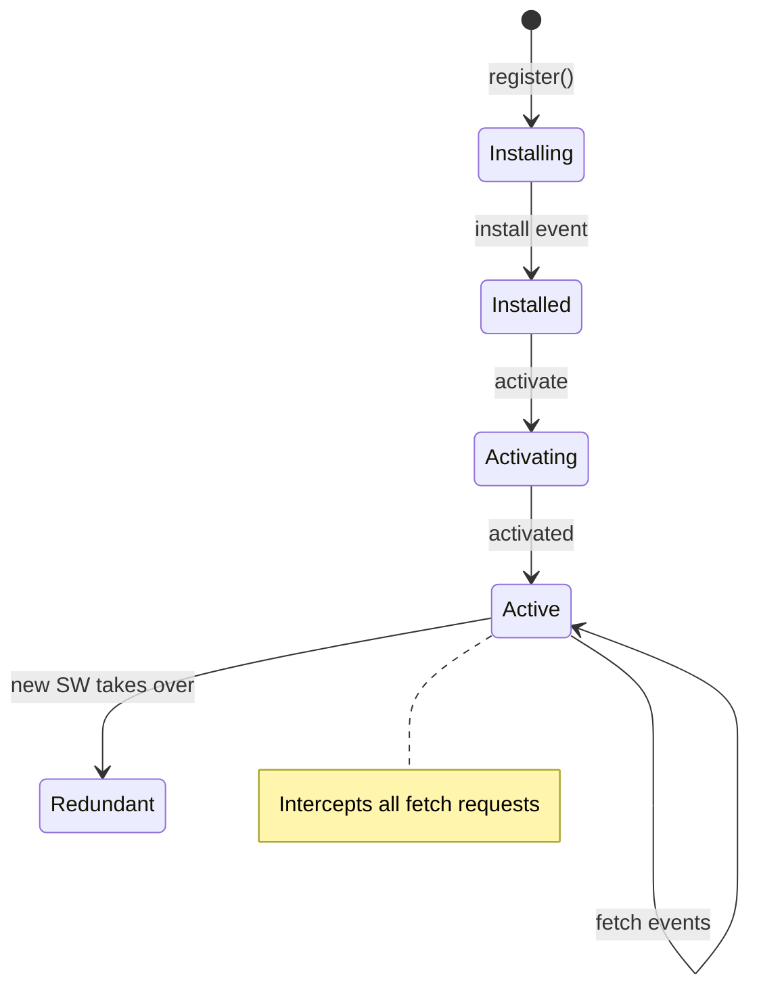

# T17: Dynamic Site - Offline

Service Workers are scripts that run in the background, separate from your web page. They intercept network requests and can serve cached responses when offline. Think of a Service Worker as a programmable proxy server living inside the browser - it decides whether to fetch from the network or serve from cache.
{: .lesson-intro }

## Registering a Service Worker

```
// In your main JS file
if ("serviceWorker" in navigator) {
    navigator.serviceWorker.register("/sw.js")
        .then(reg => console.log("SW registered"))
        .catch(err => console.error("SW failed:", err));
}
```

## The Service Worker File

```
// sw.js
const CACHE_NAME = "v1";
const ASSETS = ["/", "/index.html", "/style.css", "/app.js"];

self.addEventListener("install", event => {
    event.waitUntil(
        caches.open(CACHE_NAME)
            .then(cache => cache.addAll(ASSETS))
    );
});

self.addEventListener("fetch", event => {
    event.respondWith(
        caches.match(event.request)
            .then(cached => cached || fetch(event.request))
    );
});
```

## PWA Manifest

Add a `manifest.json` file to make your site installable as an app on mobile devices.



<div class="takeaways">
<h2>Key Takeaways</h2>
<ul>
<li>Service Workers run in the background and intercept network requests</li>
<li>Cache assets during install to enable offline functionality</li>
<li>The fetch event handler decides: serve from cache or fetch from network</li>
<li>A manifest.json file makes your web app installable on mobile devices</li>
</ul>
</div>
