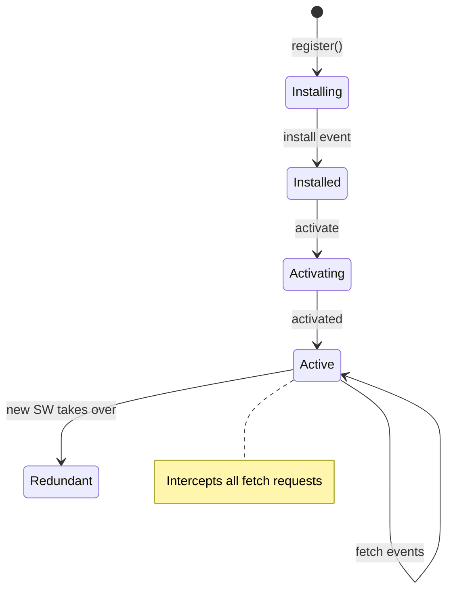

# T17: Site Dinâmico - Offline

Service Workers são scripts que rodam em segundo plano, separados da sua página web. Eles interceptam requisições de rede e podem servir respostas cacheadas quando offline. Pense num Service Worker como um servidor proxy programável morando dentro do navegador - ele decide se busca na rede ou serve do cache.
{: .lesson-intro }

## Registrando um Service Worker

```
// In your main JS file
if ("serviceWorker" in navigator) {
    navigator.serviceWorker.register("/sw.js")
        .then(reg => console.log("SW registered"))
        .catch(err => console.error("SW failed:", err));
}
```

## O Arquivo do Service Worker

```
// sw.js
const CACHE_NAME = "v1";
const ASSETS = ["/", "/index.html", "/style.css", "/app.js"];

self.addEventListener("install", event => {
    event.waitUntil(
        caches.open(CACHE_NAME)
            .then(cache => cache.addAll(ASSETS))
    );
});

self.addEventListener("fetch", event => {
    event.respondWith(
        caches.match(event.request)
            .then(cached => cached || fetch(event.request))
    );
});
```

## Manifest do PWA

Adicione um arquivo `manifest.json` para tornar seu site instalável como app em dispositivos móveis.



<div class="takeaways">
<h2>Pontos-chave</h2>
<ul>
<li>Service Workers rodam em segundo plano e interceptam requisições de rede</li>
<li>Cacheie assets durante o install para habilitar funcionalidade offline</li>
<li>O handler do evento fetch decide: servir do cache ou buscar na rede</li>
<li>Um arquivo manifest.json torna seu web app instalável em dispositivos móveis</li>
</ul>
</div>
