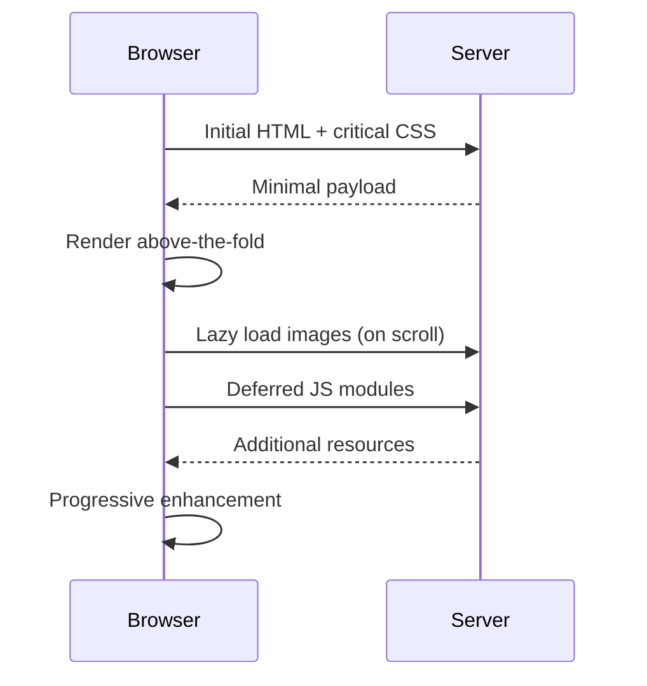

# T18: 動的サイト - 仕上げ

パフォーマンスは機能です。読み込みが遅いサイトからユーザーは離脱します。サイトの仕上げとは、何を読み込むか、いつ読み込むか、どう読み込むかの最適化です。人気料理を事前に準備し、珍しい注文だけオンデマンドで調理するレストランのようなものです。
{: .lesson-intro }

## 遅延読み込み

画像やコンテンツをビューポートに入った時だけ読み込みます。`loading="lazy"`属性で画像をネイティブに処理できます。

```


// For custom lazy loading with Intersection Observer
const observer = new IntersectionObserver((entries) => {
    entries.forEach(entry => {
        if (entry.isIntersecting) {
            const img = entry.target;
            img.src = img.dataset.src;
            observer.unobserve(img);
        }
    });
});
```

## パフォーマンステクニック

レンダリングをブロックするリソースを最小化します。重要でないJavaScriptを遅延させます。効率的なセレクタを使い、DOMサイズを削減します。

```
<!-- Defer non-critical JS -->
<script src="app.js" defer></script>

<!-- Preload critical resources -->
<link rel="preload" href="font.woff2" as="font" crossorigin>
```

## コード分割

現在のビューに必要なJavaScriptだけを読み込みます。ユーザーがナビゲートした時に追加モジュールをインポートします。

```
async function loadModule(name) {
    const module = await import(`./modules/${name}.js`);
    module.init();
}
```



<div class="takeaways">
<h2>まとめ</h2>
<ul>
<li>遅延読み込みはビューポートに入るまで非表示コンテンツの読み込みを延期します</li>
<li>scriptタグにdefer属性を使ってレンダリングブロックを回避します</li>
<li>フォントなどの重要リソースをプリロードして初回描画を高速化します</li>
<li>コード分割で現在のビューに必要なJavaScriptだけを読み込みます</li>
</ul>
</div>
