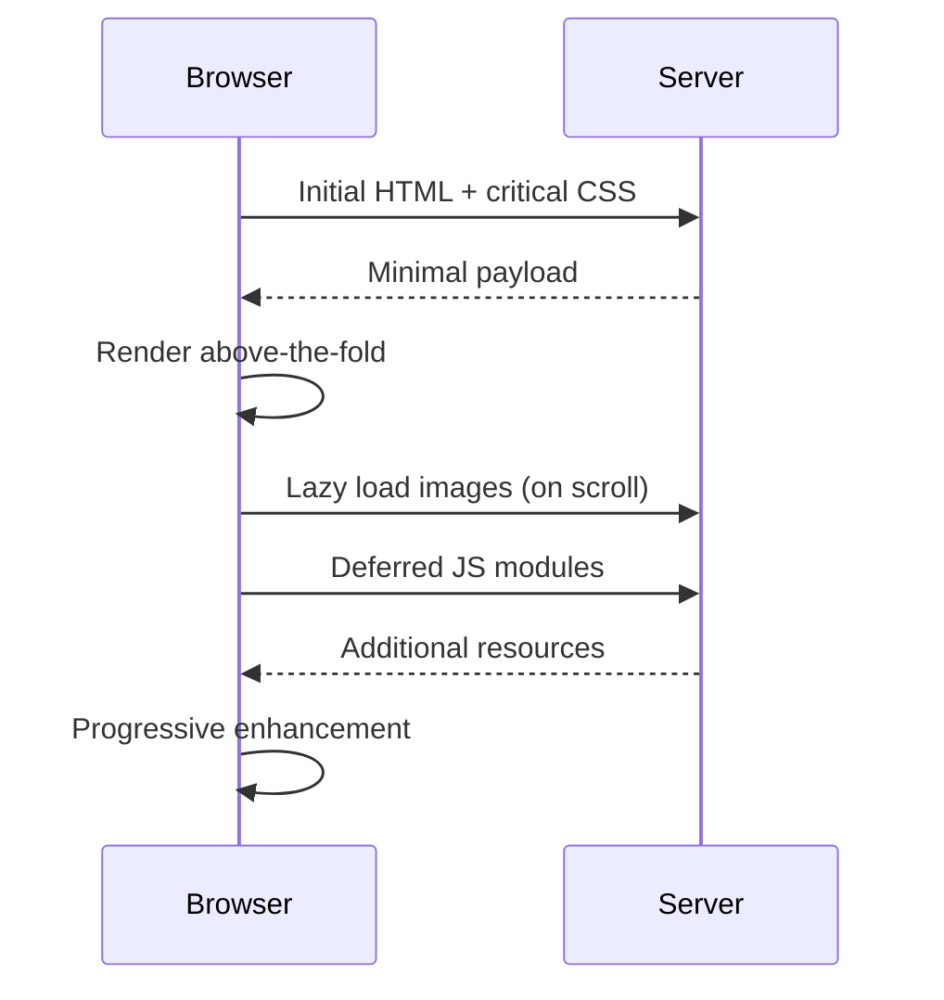

# T18: Dynamic Site - Polish

Performance is a feature. Users abandon sites that load slowly. Polishing your site means optimizing what loads, when it loads, and how it loads. Like a restaurant that prepares popular dishes in advance and only cooks rare orders on demand.
{: .lesson-intro }

## Lazy Loading

Load images and content only when they enter the viewport. The `loading="lazy"` attribute handles images natively.

```


// For custom lazy loading with Intersection Observer
const observer = new IntersectionObserver((entries) => {
    entries.forEach(entry => {
        if (entry.isIntersecting) {
            const img = entry.target;
            img.src = img.dataset.src;
            observer.unobserve(img);
        }
    });
});
```

## Performance Techniques

Minimize render-blocking resources. Defer non-critical JavaScript. Use efficient selectors and reduce DOM size.

```
<!-- Defer non-critical JS -->
<script src="app.js" defer></script>

<!-- Preload critical resources -->
<link rel="preload" href="font.woff2" as="font" crossorigin>
```

## Code Splitting

Load only the JavaScript needed for the current view. Import additional modules when the user navigates to them.

```
async function loadModule(name) {
    const module = await import(`./modules/${name}.js`);
    module.init();
}
```



<div class="takeaways">
<h2>Key Takeaways</h2>
<ul>
<li>Lazy loading defers non-visible content until it enters the viewport</li>
<li>Use defer attribute on script tags to avoid render-blocking</li>
<li>Preload critical resources like fonts to speed up first paint</li>
<li>Code splitting loads only the JavaScript needed for the current view</li>
</ul>
</div>
