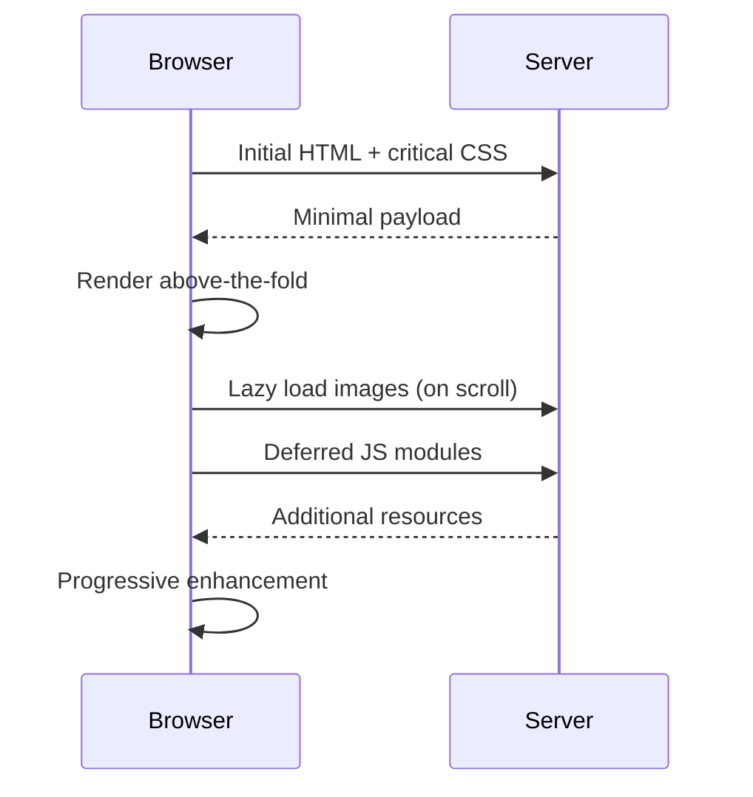

# T18: Site Dinâmico - Acabamento

Performance é uma feature. Usuários abandonam sites lentos. Dar acabamento ao seu site significa otimizar o que carrega, quando carrega e como carrega. Como um restaurante que prepara pratos populares com antecedência e só cozinha os raros sob demanda.
{: .lesson-intro }

## Lazy Loading

Carregue imagens e conteúdo só quando entrarem no viewport. O atributo `loading="lazy"` cuida disso nativamente para imagens.

```


// For custom lazy loading with Intersection Observer
const observer = new IntersectionObserver((entries) => {
    entries.forEach(entry => {
        if (entry.isIntersecting) {
            const img = entry.target;
            img.src = img.dataset.src;
            observer.unobserve(img);
        }
    });
});
```

## Técnicas de Performance

Minimize recursos que bloqueiam o render. Adie JavaScript não crítico. Use seletores eficientes e reduza o tamanho do DOM.

```
<!-- Defer non-critical JS -->
<script src="app.js" defer></script>

<!-- Preload critical resources -->
<link rel="preload" href="font.woff2" as="font" crossorigin>
```

## Code Splitting

Carregue só o JavaScript necessário para a visualização atual. Importe módulos adicionais quando o usuário navegar para eles.

```
async function loadModule(name) {
    const module = await import(`./modules/${name}.js`);
    module.init();
}
```



<div class="takeaways">
<h2>Key Takeaways</h2>
<ul>
<li>Lazy loading adia conteúdo não visível até que ele entre no viewport</li>
<li>Use o atributo defer em tags script para evitar bloqueio de render</li>
<li>Faça preload de recursos críticos como fontes para acelerar o primeiro pintar</li>
<li>Code splitting carrega só o JavaScript necessário para a visualização atual</li>
</ul>
</div>
