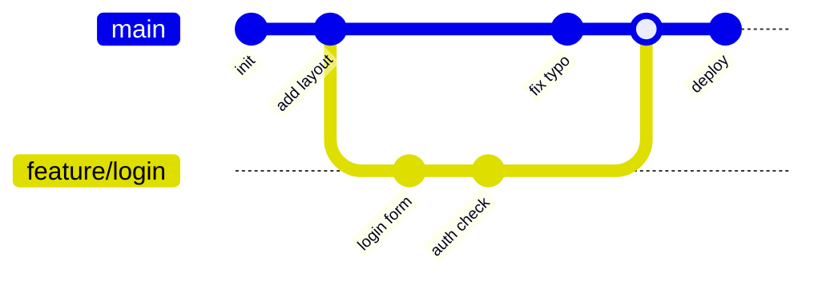
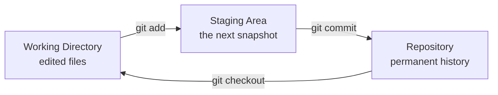

# T19: Gitの基礎

Gitはコードのタイムマシンです。小さな仕事が終わるたびにスナップショットを撮り、後から巻き戻したり、別の時間軸に分岐したり、任意の2つの瞬間を比較したりできます。写真家の作業に似ています。一日中写真を撮り(ファイルを編集)、良いものを選び(ステージング)、キャプション付きでアルバムに貼る(コミット)。 {.lesson-intro}

## 3つの領域

Gitはプロジェクトを3つのゾーンに分けます。**ワーキングディレクトリ**はディスク上の編集フォルダ。**ステージングエリア**(インデックス)は次に保存する変更を集める場所。**リポジトリ**は過去にコミットした全スナップショットの永久的な履歴です。

```
# 現在のフォルダで新しいリポジトリを開始
git init

# 自分を名乗る(マシンごとに1回)
git config --global user.name "Your Name"
git config --global user.email "you@example.com"

# 何が変わったか確認
git status
```

## 編集、ステージ、コミット

毎日のコアループ。ファイルを変更し、保存する変更を選び、メッセージ付きで保存します。メッセージは未来の自分への手紙で、*なぜ*その変更をしたかを説明します。

```
# ファイル編集後
git status                      # 何が変わった?
git add index.html styles.css   # 特定のファイルをステージ
git add .                       # または全部ステージ
git commit -m "Add contact form layout"
git log --oneline               # 履歴を見る
```

## ブランチ: 別の時間軸

ブランチはコミットを指す軽量なポインタです。メインの時間軸を乱さず何かを試したい時に作成します。満足したらマージし、気に入らなければゼロコストでブランチを捨てられます。

```
git branch                     # ブランチ一覧
git checkout -b feature/login  # 新規作成して切り替え
# ...編集、ステージ、コミット...
git checkout main              # メインに戻る
git merge feature/login        # 作業を取り込む
git branch -d feature/login    # マージ済みブランチを削除
```



図を左から右に読みます。`main`の線がデフォルトの時間軸です。`feature/login`がそこから分岐し、2つコミットして、またmainに合流します。マージ後、mainは両方の線の内容を全て含みます。



## 恐れずに取り消す

コミットはスナップショットなので、ほぼ何も失われません。`git restore`は未ステージの変更を破棄。`git reset`はファイルをアンステージ。`git revert`は古いコミットを打ち消す新しいコミットを作り、履歴を正直に保ちます。

```
git restore styles.css         # 1ファイルの編集を捨てる
git restore --staged index.html # ステージから外すが編集は保持
git revert abc123              # abc123を打ち消す新コミット
```

## 無視すべきもの

追跡すべきでないファイルがあります。秘密情報、ビルド出力、巨大バイナリ、エディタのゴミなど。リポジトリルートの`.gitignore`に列挙します。

```
# .gitignore
node_modules/
.env
*.log
.DS_Store
dist/
```

<div class="takeaways">
<h2>まとめ</h2>
<ul>
<li>Gitには3つのゾーンがある: ワーキングディレクトリ、ステージングエリア、リポジトリ。全コマンドはこの間で内容を動かす</li>
<li>コミットは追跡中の全ファイルのスナップショットと「なぜ」を説明するメッセージ</li>
<li>ブランチはコミットへの軽量なポインタ。機能や実験ごとに作る</li>
<li>コミットメッセージは未来の自分への手紙。何ではなくなぜを書く</li>
<li>最初のコミット前に秘密情報と生成ファイルを.gitignoreに入れる</li>
</ul>
</div>
