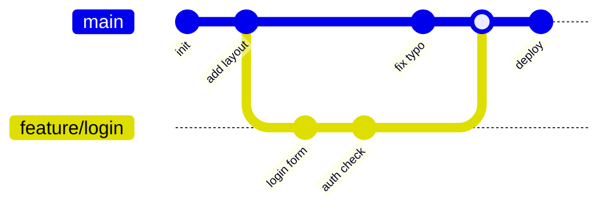
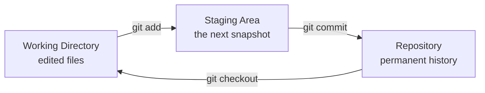

# T19: Git Basics

Git is a time machine for your code. Every time you finish a small piece of work, you take a snapshot. Later you can rewind, branch into an alternate timeline, or compare any two moments. Think of it as a photographer's workflow: you shoot pictures all day (editing files), pick the keepers (staging), and paste them into a photo album with a caption (committing).
{: .lesson-intro }

## The Three Areas

Git splits your project into three zones. The **working directory** is the folder on disk where you edit. The **staging area** (or index) is where you gather the exact changes you want to save next. The **repository** is the permanent history of every snapshot you have ever committed.

```
# Start a new repo in the current folder
git init

# Tell git who you are (once per machine)
git config --global user.name "Your Name"
git config --global user.email "you@example.com"

# See what has changed
git status
```

## Edit, Stage, Commit

The core loop of every day: change files, choose which changes to save, save them with a message. The message is a note to your future self explaining *why* you made the change.

```
# After editing some files
git status                      # what changed?
git add index.html styles.css   # stage specific files
git add .                       # or stage everything
git commit -m "Add contact form layout"
git log --oneline               # browse history
```

## Branches: Alternate Timelines

A branch is a lightweight pointer to a commit. You spin one up when you want to try something without disturbing the main timeline. When you are happy, you merge it back. When you are not, you throw the branch away at zero cost.

```
git branch                     # list branches
git checkout -b feature/login  # create and switch to new branch
# ...edit, stage, commit...
git checkout main              # back to main timeline
git merge feature/login        # fold the work in
git branch -d feature/login    # delete the now-merged branch
```



Read this diagram left to right. The `main` line is your default timeline. `feature/login` splits off, gets two commits, and is merged back in. After the merge, main contains everything from both lines.



## Undo Without Fear

Because commits are snapshots, almost nothing is ever truly lost. `git restore` discards unstaged changes. `git reset` unstages a file. `git revert` creates a new commit that undoes an old one, keeping history honest.

```
git restore styles.css         # throw away edits in one file
git restore --staged index.html # unstage but keep edits
git revert abc123              # undo commit abc123 with a new commit
```

## What to Ignore

Some files should never be tracked: secrets, build output, huge binaries, editor junk. List them in a `.gitignore` file at the repo root.

```
# .gitignore
node_modules/
.env
*.log
.DS_Store
dist/
```

<div class="takeaways">
<h2>Key Takeaways</h2>
<ul>
<li>Git has three zones: working directory, staging area, repository. All commands move content between them</li>
<li>A commit is a snapshot of every tracked file plus a message explaining why</li>
<li>Branches are cheap pointers to commits. Create one for every feature or experiment</li>
<li>Commit messages are letters to your future self. Explain the why, not just the what</li>
<li>Put secrets and generated files in .gitignore before your first commit</li>
</ul>
</div>
