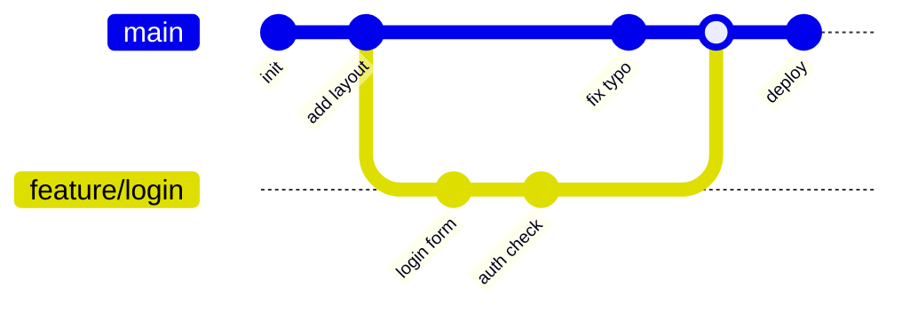
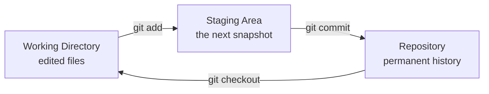

# T19: Fundamentos de Git

Git é uma máquina do tempo para seu código. Toda vez que você termina um pedacinho de trabalho, você tira um snapshot. Depois você pode rebobinar, criar uma linha do tempo alternativa ou comparar quaisquer dois momentos. Pense no fluxo de um fotógrafo: você bate fotos o dia todo (editando arquivos), escolhe as que valem (staging) e cola no álbum com legenda (commit).
{: .lesson-intro }

## As Três Áreas

Git divide seu projeto em três zonas. O **working directory** (diretório de trabalho) é a pasta em disco onde você edita. A **staging area** (área de preparação, ou index) é onde você junta as mudanças exatas que quer salvar a seguir. O **repository** (repositório) é o histórico permanente de cada snapshot que você já commitou.

```
# Start a new repo in the current folder
git init

# Tell git who you are (once per machine)
git config --global user.name "Your Name"
git config --global user.email "you@example.com"

# See what has changed
git status
```

## Edit, Stage, Commit

O loop central de todo dia: mudar arquivos, escolher quais mudanças salvar, salvar com uma mensagem. A mensagem é um recado para o seu eu futuro explicando *por que* você fez a mudança.

```
# After editing some files
git status                      # what changed?
git add index.html styles.css   # stage specific files
git add .                       # or stage everything
git commit -m "Add contact form layout"
git log --oneline               # browse history
```

## Branches: Linhas do Tempo Alternativas

Um branch é um ponteiro leve para um commit. Você cria um quando quer testar algo sem mexer na linha do tempo principal. Quando gosta, faz merge de volta. Quando não, joga o branch fora a custo zero.

```
git branch                     # list branches
git checkout -b feature/login  # create and switch to new branch
# ...edit, stage, commit...
git checkout main              # back to main timeline
git merge feature/login        # fold the work in
git branch -d feature/login    # delete the now-merged branch
```



Leia o diagrama da esquerda para a direita. A linha `main` é sua linha do tempo padrão. `feature/login` se separa, ganha dois commits e volta para o merge. Depois do merge, main contém tudo das duas linhas.



## Desfazer Sem Medo

Como commits são snapshots, quase nada se perde de verdade. `git restore` descarta mudanças não preparadas. `git reset` tira um arquivo do stage. `git revert` cria um novo commit que desfaz um antigo, mantendo o histórico honesto.

```
git restore styles.css         # throw away edits in one file
git restore --staged index.html # unstage but keep edits
git revert abc123              # undo commit abc123 with a new commit
```

## O Que Ignorar

Alguns arquivos nunca devem ser rastreados: segredos, saída de build, binários enormes, lixo do editor. Liste no arquivo `.gitignore` na raiz do repo.

```
# .gitignore
node_modules/
.env
*.log
.DS_Store
dist/
```

<div class="takeaways">
<h2>Pontos-chave</h2>
<ul>
<li>Git tem três zonas: diretório de trabalho, staging area, repositório. Todos os comandos movem conteúdo entre eles</li>
<li>Um commit é um snapshot de todo arquivo rastreado mais uma mensagem explicando o porquê</li>
<li>Branches são ponteiros baratos para commits. Crie um para cada feature ou experimento</li>
<li>Mensagens de commit são cartas para o seu eu futuro. Explique o porquê, não só o que</li>
<li>Ponha segredos e arquivos gerados no .gitignore antes do primeiro commit</li>
</ul>
</div>
