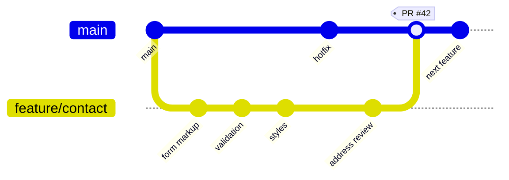
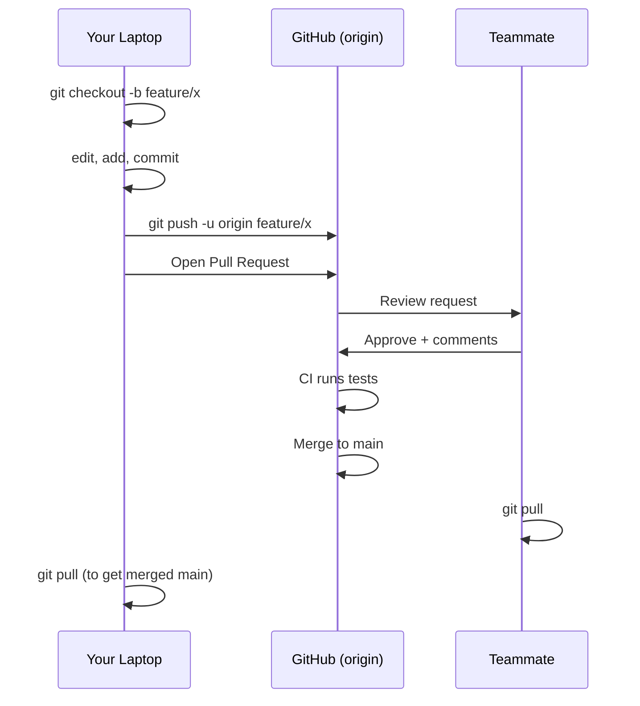

# T20: GitHubとコラボレーション

Gitは机の上の個人用タイムマシン。GitHubは多くのタイムトラベラーが集まり、メモを比べ、一緒に作る共有工房です。同じリポジトリが2か所に存在します。あなたのラップトップとクラウドです。プッシュとプルでそれらを同期します。 {.lesson-intro}

## リモート: コピーのありか

**リモート**は別の場所にあるリポジトリのコピーを指す名前付きURLです。慣習的にメインリモートは`origin`と呼ばれます。コミットをoriginへ押し上げ、originから引き下ろします。

```
# 既存のGitHubリポジトリから開始
git clone https://github.com/you/my-project.git
cd my-project
git remote -v                  # リモート一覧

# またはローカルリポジトリを新しいGitHubリポジトリへ
git remote add origin https://github.com/you/my-project.git
git branch -M main
git push -u origin main        # -uでデフォルトupstreamを設定
```

## プッシュとプル

プッシュはローカルのコミットをリモートへアップロードします。プルはリモートのコミットを現在のブランチにダウンロードしてマージします。新しい作業を始める前に必ずプルし、最新の上に積み上げましょう。

```
git pull                       # originからfetch + merge
git push                       # コミットを送信

# 新ブランチの初プッシュ
git push -u origin feature/login
```

## GitHub Flow: 初心者向けワークフロー

GitHub Flowは最もシンプルなプロのワークフローです。ルールは1つ。**main**は常にデプロイ可能。それ以外は全てプルリクエスト後ろの短命ブランチで起こります。

1. mainから変更用ブランチを作成
2. 作業しながらコミット
3. ブランチをプッシュし**プルリクエスト**(PR)を開く
4. チームメイトがレビュー、CIがテストを自動実行
5. グリーンならマージ、ブランチ削除、最新mainをプル



ブランチはプルリクエストと同じ期間だけ生き、マージ後に削除されます。`PR #42`のタグは、そのマージコミット周辺で起きた会話、レビュー、CIチェックの永続的な記録です。



## プルリクエスト: コード周辺の会話

PRはマージボタン以上のものです。何をしたか、なぜか、誰がレビューしたか、どのテストが走ったかの永久記録です。PRの説明は6か月後のチームメイトに説明するように書きましょう。

```
## Summary
Adds a contact form to the landing page.

## Why
Closes #42. Users had no way to reach us outside Discord.

## Test plan
- [x] Form validates required fields
- [x] Submission shows success toast
- [ ] Confirm email arrives in inbox
```

## マージコンフリクト

2つのブランチが同じ行を編集するとgitは止まって判断を求めます。ファイル内に`<<<<<<<`、`=======`、`>>>>>>>`でコンフリクトを記します。正しい版を選び、マーカーを削除し、ステージしてコミットします。

```
<<<<<<< HEAD
color: blue;
=======
color: green;
>>>>>>> feature/login
```

<div class="takeaways">
<h2>まとめ</h2>
<ul>
<li>GitHubはリポジトリのリモートコピーを保存。originが慣習的な名前</li>
<li>プッシュは上へ、プルは下へ。新しい作業を始める前に必ずプル</li>
<li>GitHub Flow: mainからブランチ、コミット、プッシュ、PR、レビュー、マージ、ブランチ削除</li>
<li>PRの説明は読み手のために書く。なぜを説明する</li>
<li>マージコンフリクトは正常。マーカーを読み、版を選び、再コミット</li>
</ul>
</div>
