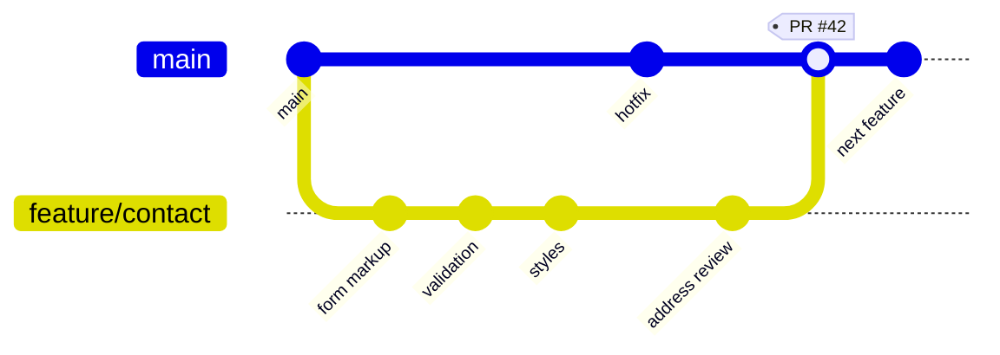
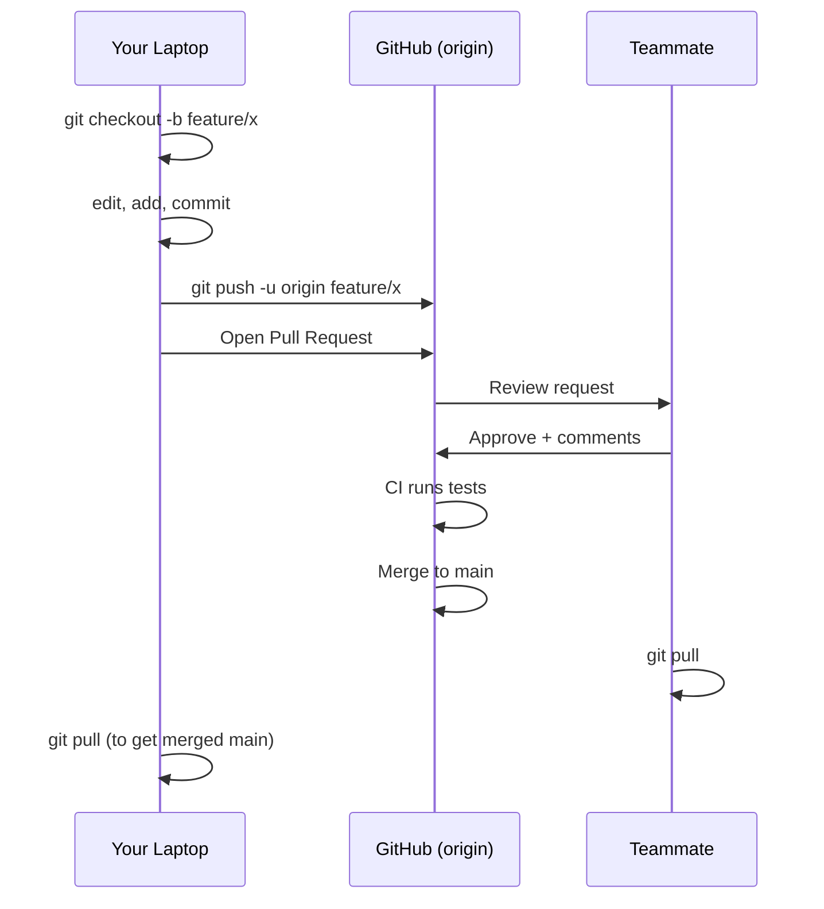

# T20: GitHub & Collaboration

Git is your personal time machine on your desk. GitHub is the shared workshop where many time travelers meet, compare notes, and build together. The same repository lives in two places at once: your laptop and the cloud. Pushing and pulling keeps them in sync.
{: .lesson-intro }

## Remotes: Where the Copy Lives

A **remote** is a named URL pointing to a copy of your repository somewhere else. By convention the main remote is called `origin`. You push commits up to origin and pull commits down from it.

```
# Start from an existing GitHub repo
git clone https://github.com/you/my-project.git
cd my-project
git remote -v                  # list remotes

# Or push an existing local repo to a new GitHub repo
git remote add origin https://github.com/you/my-project.git
git branch -M main
git push -u origin main        # -u sets the default upstream
```

## Push and Pull

Push uploads your local commits to the remote. Pull downloads and merges remote commits into your current branch. Always pull before you start new work so you are building on the latest.

```
git pull                       # fetch + merge from origin
git push                       # send your commits up

# First push of a new branch
git push -u origin feature/login
```

## GitHub Flow: The Beginner-Friendly Workflow

GitHub Flow is the simplest pro workflow. One rule: **main** is always deployable. Everything else happens on short-lived branches behind a pull request.

1. Create a branch off main for your change
2. Commit as you work
3. Push the branch and open a **pull request** (PR)
4. A teammate reviews, CI runs tests automatically
5. Merge when green, delete the branch, pull latest main



The branch lives only as long as the pull request. Once merged, it is deleted. The `PR #42` tag is the lasting record of the conversation, the review, and the CI checks that happened around that merge commit.



## Pull Requests: Conversations Around Code

A PR is more than a merge button. It is a permanent record of what you did, why, who reviewed it, and what tests ran. Write PR descriptions like you are explaining the change to a teammate six months from now.

```
## Summary
Adds a contact form to the landing page.

## Why
Closes #42. Users had no way to reach us outside Discord.

## Test plan
- [x] Form validates required fields
- [x] Submission shows success toast
- [ ] Confirm email arrives in inbox
```

## Merge Conflicts

When two branches edit the same line, git stops and asks you to decide. It marks the conflict in the file with `<<<<<<<`, `=======`, and `>>>>>>>`. Pick the right version, delete the markers, stage, and commit.

```
<<<<<<< HEAD
color: blue;
=======
color: green;
>>>>>>> feature/login
```

<div class="takeaways">
<h2>Key Takeaways</h2>
<ul>
<li>GitHub stores a remote copy of your repo. origin is the conventional name</li>
<li>Push sends commits up, pull brings them down. Pull before starting new work</li>
<li>GitHub Flow: branch off main, commit, push, open PR, get review, merge, delete branch</li>
<li>Write pull request descriptions for the reader, not the author. Explain why</li>
<li>Merge conflicts are normal. Read the markers, choose a version, re-commit</li>
</ul>
</div>
