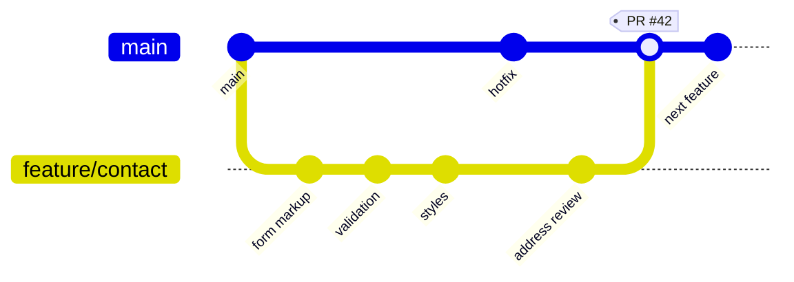
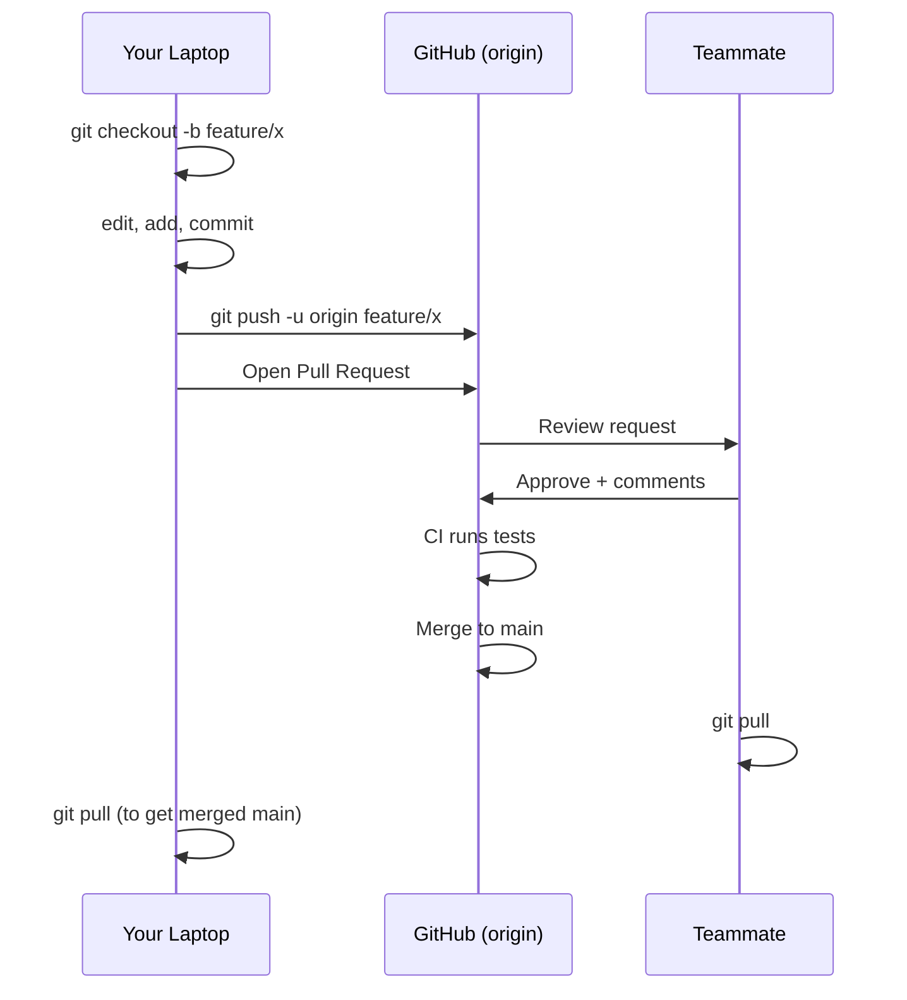

# T20: GitHub e Colaboração

Git é sua máquina do tempo pessoal na sua mesa. GitHub é a oficina compartilhada onde vários viajantes do tempo se encontram, comparam anotações e constroem juntos. O mesmo repositório vive em dois lugares ao mesmo tempo: seu laptop e a nuvem. Push e pull mantêm os dois sincronizados.
{: .lesson-intro }

## Remotes: Onde a Cópia Vive

Um **remote** é uma URL nomeada que aponta para uma cópia do seu repositório em outro lugar. Por convenção, o remote principal se chama `origin`. Você faz push dos commits para o origin e pull dos commits de lá.

```
# Start from an existing GitHub repo
git clone https://github.com/you/my-project.git
cd my-project
git remote -v                  # list remotes

# Or push an existing local repo to a new GitHub repo
git remote add origin https://github.com/you/my-project.git
git branch -M main
git push -u origin main        # -u sets the default upstream
```

## Push e Pull

Push envia seus commits locais para o remote. Pull baixa e faz merge de commits do remote no seu branch atual. Sempre dê pull antes de começar trabalho novo para construir em cima do mais recente.

```
git pull                       # fetch + merge from origin
git push                       # send your commits up

# First push of a new branch
git push -u origin feature/login
```

## GitHub Flow: O Fluxo Amigável para Iniciantes

GitHub Flow é o fluxo profissional mais simples. Uma regra: **main** está sempre pronto para deploy. Todo o resto acontece em branches de vida curta por trás de um pull request.

1. Crie um branch a partir de main para sua mudança
2. Faça commits conforme trabalha
3. Push o branch e abra um **pull request** (PR)
4. Um colega revisa, o CI roda testes automaticamente
5. Merge quando estiver verde, delete o branch, pull o main mais recente



O branch só vive enquanto o pull request está aberto. Depois do merge, é deletado. A tag `PR #42` é o registro permanente da conversa, da revisão e dos checks de CI que aconteceram em torno daquele merge commit.



## Pull Requests: Conversas em Torno de Código

Um PR é mais que um botão de merge. É um registro permanente do que você fez, por quê, quem revisou e quais testes rodaram. Escreva descrições de PR como se estivesse explicando a mudança para um colega daqui a seis meses.

```
## Summary
Adds a contact form to the landing page.

## Why
Closes #42. Users had no way to reach us outside Discord.

## Test plan
- [x] Form validates required fields
- [x] Submission shows success toast
- [ ] Confirm email arrives in inbox
```

## Conflitos de Merge

Quando dois branches editam a mesma linha, o git para e pede para você decidir. Ele marca o conflito no arquivo com `<<<<<<<`, `=======` e `>>>>>>>`. Escolha a versão certa, apague os marcadores, faça stage e commit.

```
<<<<<<< HEAD
color: blue;
=======
color: green;
>>>>>>> feature/login
```

<div class="takeaways">
<h2>Key Takeaways</h2>
<ul>
<li>GitHub guarda uma cópia remota do seu repo. origin é o nome convencional</li>
<li>Push envia commits para cima, pull traz para baixo. Dê pull antes de começar trabalho novo</li>
<li>GitHub Flow: branch a partir de main, commit, push, abra PR, revisão, merge, delete o branch</li>
<li>Escreva descrições de pull request para o leitor, não para o autor. Explique o porquê</li>
<li>Conflitos de merge são normais. Leia os marcadores, escolha uma versão, re-commite</li>
</ul>
</div>
