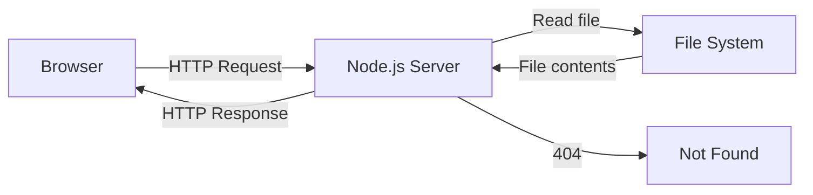

# T21: Node.jsサーバー

これまでHTMLファイルをブラウザで直接開いていました。Webサーバーはリクエストを待ち受けてレスポンスを返すプログラムです。Node.jsならブラウザと同じJavaScriptでサーバーを書けます。チーム全員と同じ言語を話す受付を雇うようなものです。
{: .lesson-intro }

## HTTPサーバーの作成

```
const http = require("http");
const fs = require("fs");
const path = require("path");

const server = http.createServer((req, res) => {
    const filePath = path.join(__dirname, "public", req.url === "/" ? "index.html" : req.url);
    const ext = path.extname(filePath);
    const contentTypes = {
        ".html": "text/html",
        ".css": "text/css",
        ".js": "text/javascript"
    };

    fs.readFile(filePath, (err, content) => {
        if (err) {
            res.writeHead(404);
            res.end("Not Found");
            return;
        }
        res.writeHead(200, { "Content-Type": contentTypes[ext] || "text/plain" });
        res.end(content);
    });
});

server.listen(3000, () => console.log("Server on http://localhost:3000"));
```

## 静的ファイルの配信

サーバーは"public"フォルダからファイルを読み取り、正しいContent-Typeヘッダー付きでブラウザに送信します。



<div class="takeaways">
<h2>まとめ</h2>
<ul>
<li>Node.jsはブラウザの外でサーバー上のJavaScriptを実行します</li>
<li>http.createServerでリクエストとレスポンスを処理するサーバーを作成します</li>
<li>Content-Typeヘッダーがブラウザにレスポンスの解釈方法を伝えます</li>
<li>静的ファイル配信はURLパスをディスク上のファイルにマッピングします</li>
</ul>
</div>
