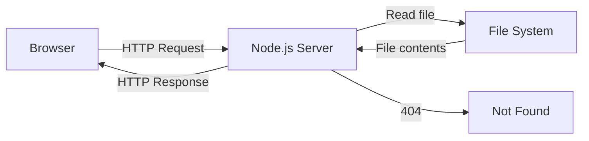

# T21: Node.js Server

Until now, you have been opening HTML files directly in the browser. A web server is a program that listens for requests and sends back responses. Node.js lets you write that server in JavaScript - the same language you already know from the browser. It is like hiring a receptionist who speaks the same language as your entire team. {.lesson-intro}

## Creating an HTTP Server

```
const http = require("http");
const fs = require("fs");
const path = require("path");

const server = http.createServer((req, res) => {
    const filePath = path.join(__dirname, "public", req.url === "/" ? "index.html" : req.url);
    const ext = path.extname(filePath);
    const contentTypes = {
        ".html": "text/html",
        ".css": "text/css",
        ".js": "text/javascript"
    };

    fs.readFile(filePath, (err, content) => {
        if (err) {
            res.writeHead(404);
            res.end("Not Found");
            return;
        }
        res.writeHead(200, { "Content-Type": contentTypes[ext] || "text/plain" });
        res.end(content);
    });
});

server.listen(3000, () => console.log("Server on http://localhost:3000"));
```

## Serving Static Files

The server reads files from the "public" folder and sends them to the browser with the correct content type header.



<div class="takeaways">
<h2>Key Takeaways</h2>
<ul>
<li>Node.js runs JavaScript outside the browser on your server</li>
<li>http.createServer creates a server that handles requests and responses</li>
<li>Content-Type headers tell the browser how to interpret the response</li>
<li>Static file serving maps URL paths to files on disk</li>
</ul>
</div>
