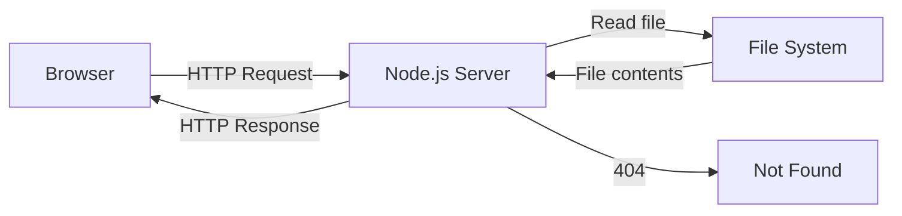

# T21: Servidor Node.js

Até aqui, você estava abrindo arquivos HTML direto no navegador. Um servidor web é um programa que escuta requisições e devolve respostas. Node.js te deixa escrever esse servidor em JavaScript - a mesma linguagem que você já conhece do navegador. É como contratar uma recepcionista que fala a mesma língua do time inteiro.
{: .lesson-intro }

## Criando um Servidor HTTP

```
const http = require("http");
const fs = require("fs");
const path = require("path");

const server = http.createServer((req, res) => {
    const filePath = path.join(__dirname, "public", req.url === "/" ? "index.html" : req.url);
    const ext = path.extname(filePath);
    const contentTypes = {
        ".html": "text/html",
        ".css": "text/css",
        ".js": "text/javascript"
    };

    fs.readFile(filePath, (err, content) => {
        if (err) {
            res.writeHead(404);
            res.end("Not Found");
            return;
        }
        res.writeHead(200, { "Content-Type": contentTypes[ext] || "text/plain" });
        res.end(content);
    });
});

server.listen(3000, () => console.log("Server on http://localhost:3000"));
```

## Servindo Arquivos Estáticos

O servidor lê arquivos da pasta "public" e envia para o navegador com o header de content type correto.



<div class="takeaways">
<h2>Pontos-chave</h2>
<ul>
<li>Node.js roda JavaScript fora do navegador, no seu servidor</li>
<li>http.createServer cria um servidor que trata requisições e respostas</li>
<li>Headers Content-Type dizem ao navegador como interpretar a resposta</li>
<li>Servir arquivos estáticos é mapear caminhos de URL para arquivos no disco</li>
</ul>
</div>
