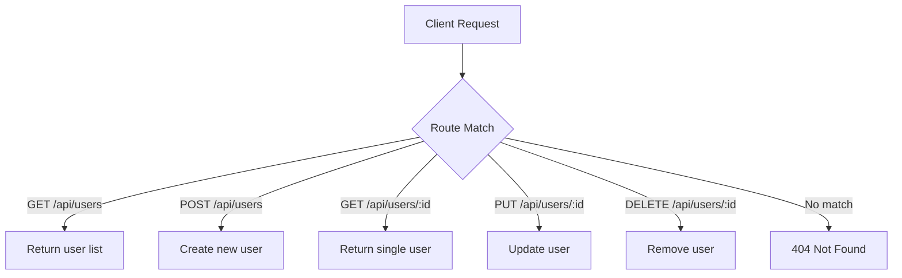

# T22: APIエンドポイント

API(アプリケーションプログラミングインターフェース)はサーバーがクライアントにデータ操作のために公開するエンドポイントの集合です。RESTはURLがリソースを、HTTPメソッドがアクションを表すデザイン規約です。レストランのメニューのようなものです。何を注文できて、どう注文するかがリストされています。 {.lesson-intro}

## REST規約

RESTful APIはパターンに従います。リソースはURLの名詞、アクションはHTTPメソッドです。

```
// GET    /api/users      - List all users
// GET    /api/users/1    - Get user with id 1
// POST   /api/users      - Create a new user
// PUT    /api/users/1    - Update user 1
// DELETE /api/users/1    - Delete user 1
```

## エンドポイントの構築

```
const server = http.createServer((req, res) => {
    const url = req.url;
    const method = req.method;

    res.setHeader("Content-Type", "application/json");

    if (url === "/api/users" && method === "GET") {
        res.end(JSON.stringify(users));
    } else if (url === "/api/users" && method === "POST") {
        let body = "";
        req.on("data", chunk => body += chunk);
        req.on("end", () => {
            const user = JSON.parse(body);
            users.push(user);
            res.writeHead(201);
            res.end(JSON.stringify(user));
        });
    } else {
        res.writeHead(404);
        res.end(JSON.stringify({ error: "Not Found" }));
    }
});
```



<div class="takeaways">
<h2>まとめ</h2>
<ul>
<li>RESTはURLをリソース識別子、HTTPメソッドをアクションとして使います</li>
<li>GETは読取、POSTは作成、PUTは更新、DELETEは削除</li>
<li>APIレスポンスは適切なステータスコード付きのJSONにすべきです</li>
<li>未知のルートは必ず404レスポンスで処理しましょう</li>
</ul>
</div>
